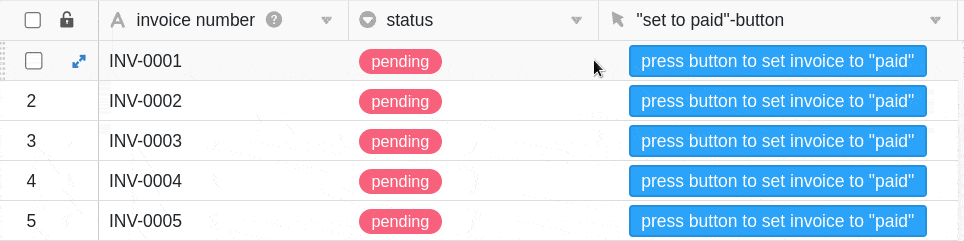

La columna de botones tiene una función similar a [las automatizaciones](), en las que siempre hay que accionar los botones **manualmente**. Con la ayuda del **botón** que puede añadir a sus **filas en** esta columna, desencadena **acciones** definidas de antemano. Por esta razón, este tipo de columna es especialmente adecuado para automatizar los pasos del proceso.

## Crear el botón

En primer lugar, asigne un nombre a la **columna** y defina la **etiqueta** y el **color del botón** que desea añadir a las filas.

En el paso siguiente, defina el número de **acciones** que se desencadenarán al activar el botón. Tiene la posibilidad de cambiar **varias** acciones sucesivamente.

Puedes elegir entre un total de **nueve** acciones diferentes:

- Línea de bloqueo
- Editar línea
- Copiar fila a otra tabla
- Abrir URL
- Abrir plugin (sólo es posible si ha activado al menos un [plugin]() )
- Guardar archivo PDF en columna (sólo es posible si está activado el [plug-in de diseño de página]() )
- Enviar notificación
- Enviar correo electrónico
- Ejecutar el script

## Ejemplo de aplicación

En este ejemplo de aplicación, utilizamos el botón para asignar el estado "pagado" a las facturas pagadas con un clic del ratón. Para ello utilizamos la acción **Editar fila**.

En la **configuración de la columna**, especificamos que las entradas de la columna de selección única **"estado** " pasen de **"pendiente"** a **"pagado** " al activar el botón.

Tras hacer clic en el botón, el **estado de** la factura seleccionada cambia a **pagada.**

### Posibilidad adicional

Para ampliar la automatización de los pasos del proceso, también puede utilizar botones en combinación con [automatizaciones]() las **líneas** con las facturas respectivas que se hayan configurado como pagadas para su procesamiento.

