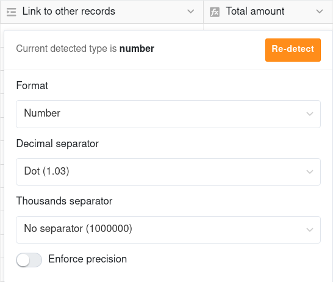

Mit einer Formel für Verknüpfungen können Sie **Daten aus verknüpften Tabellen** in Ihrer aktuellen Tabelle **darstellen, zusammenfassen oder miteinander in Beziehung setzen**. Hierbei spielt SeaTable seine Vorteile als relationale Datenbank aus.

Für den Spaltentyp stehen Ihnen insgesamt **fünf verschiedene Formeln** zur Verfügung. Voraussetzung für die Verwendung der Spalte ist das Vorhandensein von mindestens einer Spalte des Typs [Verknüpfung zu anderen Einträgen]() in Ihrer Tabelle.

## Anlegen einer Formel-für-Verknüpfungen-Spalte

Um eine Formel anzuwenden, müssen Sie zunächst eine neue Formel-für-Verknüpfungen-Spalte zu Ihrer Tabelle hinzufügen.

1. Klicken Sie auf das **Plus-Symbol** rechts neben der letzten Spalte.
2. Geben Sie der Spalte einen **Namen**.
3. Wählen Sie als Spaltentyp **Formel für Verknüpfungen** aus.
4. Entscheiden Sie sich für eine **Formel** (z. B. Rollup).
5. Wählen Sie die **Verknüpfungsspalte** der Tabelle, aus der Sie Daten verwenden möchten.
6. Geben Sie die **Spalte in der verknüpften Tabelle** an, auf die sich die Formel beziehen soll.
7. Je nach gewählter Formel können Sie **weitere Einstellungen** vornehmen.
8. Legen Sie die Spalte mit **Abschicken** an.

## 5 Formeln für Verknüpfungen

Weitere Informationen und Beispiele zu den fünf verschiedenen Formeln finden Sie in den folgenden Artikeln, die den Nutzen und die Nutzung der Formeln veranschaulichen:
- [Lookup]()
- [Countlinks]()
- [Rollup]()
- [Findmax]()
- [Findmin]()

## Formatierung der Ergebnisse

Jede Formel in SeaTable hat eine **Zahl**, ein **Datum** oder einen **Text/String** als Ergebnis. Die Ergebnisse in einer Formel-für-Verknüpfungen-Spalte bekommen automatisch ein bestimmtes **Format** zugewiesen. Wenn Sie mit diesem nicht zufrieden sind, können Sie es **neu ermitteln**. Klicken Sie dazu auf den **Drop-down-Pfeil** rechts neben dem Spaltennamen und dann auf **Formateinstellungen bearbeiten**.

Bei Countlinks- und Rollup-Spalten stehen Ihnen zudem unterschiedliche **Formateinstellungen für Zahlen** zur Verfügung: Prozent, Währungen oder Dauer sowie Dezimaltrennzeichen, Tausendertrennzeichen und Nachkommastellen.