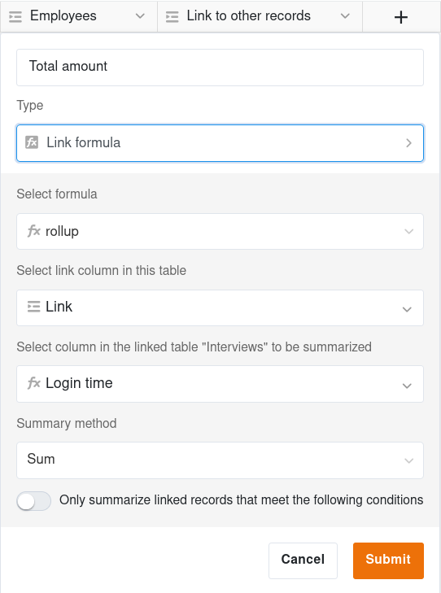
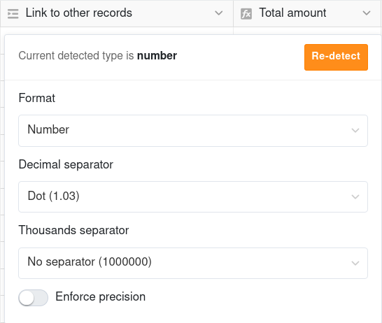

С помощью формулы для связей Вы можете **отображать, обобщать или соотносить данные из связанных таблиц** в Вашей текущей таблице. Именно здесь SeaTable демонстрирует свои преимущества как реляционная база данных.

В общей сложности для этого типа столбцов доступно **пять различных формул**. Необходимым условием использования столбца является наличие в Вашей таблице хотя бы одного столбца типа [ссылка на другие записи]().

## Создайте колонку с формулой связи

Чтобы применить формулу, Вы должны сначала добавить новый столбец Формула связи в Вашу таблицу.

1. Нажмите на символ **Плюс** справа от последней колонки.
2. Дайте колонке **Имя**.
3. Выберите **Формула связи** в качестве типа столбца.
4. Определитесь с **Формулой** (например, Свернуть).
5. Выберите **Столбец связи** таблицы, данные из которой Вы хотите использовать.
6. Укажите **столбец в связанной таблице**, на который должна ссылаться формула.
7. В зависимости от выбранной формулы, Вы можете сделать **дальнейшие настройки**.
8. Создайте столбец с помощью **Отправить**.

## 5 Формулы связи

Дополнительную информацию и примеры использования пяти различных формул Вы найдете в следующих статьях, которые иллюстрируют преимущества и применение формул:
- [Lookup]()
- [Countlinks]()
- [Rollup]()
- [Findmax]()
- [Findmin]()

## Форматирование результатов

Каждая формула в SeaTable имеет в качестве результата **число**, **дату** или **текст/строку**. Результатам в колонке формулы связи автоматически присваивается определенный **формат**. Если Вас это не устраивает, Вы можете **Повторно обнаружить** его. Для этого нажмите на **удаляющуюся стрелку** справа от названия столбца, а затем на **Изменить настройки формата**.

Различные настройки **формата для чисел** также доступны для счетных ссылок и сворачивающихся колонок: Процент, Валюта или Период, а также десятичные разделители, разделители тысяч и Точность.