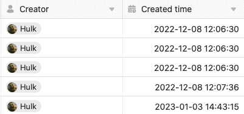
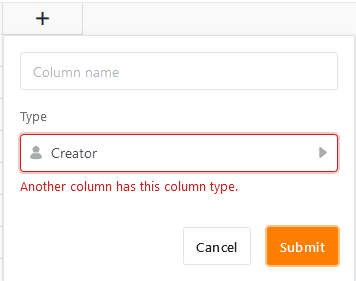

Las columnas **Creador** y **Fecha y hora de creación** son rellenadas exclusivamente **de forma automática** por SeaTable y, por lo tanto, representan tipos de columna especiales. Mientras que SeaTable rellena la columna creador con el **nombre del usuario** que creó una fila, la columna fecha y hora de creación registra la **fecha y hora** en que el usuario creó la fila.

## Características especiales de los dos tipos de columnas

- Los valores introducidos automáticamente en las columnas Creador y Fecha de creación **no pueden** editarse.
- Al crear los dos tipos de columna, **no** hay opciones disponibles, aparte del nombre de la columna.
- Sólo se puede crear **una** columna de creador y fecha de creación por tabla. Si intenta crear otra columna del mismo tipo, aparece el mensaje "Otra columna tiene este tipo de columna".

- Por este motivo, no puede **duplicar** las columnas de fecha de creación y creador **ni personalizar su tipo de columna**.
