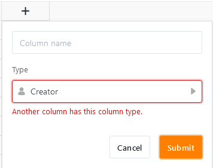

Колонки **Создатель** и **Время создания** заполняются SeaTable исключительно **автоматически** и поэтому представляют собой специальные типы колонок. В то время как SeaTable заполняет колонку "Создатель" **именем пользователя**, создавшего строку, в колонке "Время создания" записывается **дата и время**, когда пользователь создал строку.

## Особенности двух типов колонн

- Автоматически введенные значения в столбцах Создатель и Время создания **не** могут быть отредактированы.
- При **создании** двух типов столбцов, кроме имени столбца, **никаких** опций **не** предусмотрено.
- В одной таблице можно создать только **один** столбец "Создатель" и "Время создания". Если попытаться создать еще один столбец того же типа, то появится сообщение "Another column has this column type".

- По этой причине нельзя **дублировать** столбцы "Создатель" и "Время создания" **, а также настраивать тип этих столбцов**.
