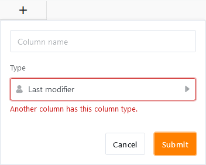

The columns **Last modifier** and **Last modified time** are exclusively filled **automatically** by SeaTable and therefore represent special column types. They prove to be extremely useful if you want to track **when** and **by whom** an entry was **last edited**.

Since the two columns automatically capture changes to entries, they are well suited, for example, as triggers for [automations]() and [sorting]().

## The columns Last modifier and Last modified time

While SeaTable fills the **Last modifier** column with the name of the user who last edited the row, the **Last modified time** column records the moment (date and time) when the last edit occurred.

## Special features of the two column types

- You **cannot** manually change the automatically entered values in the Last modifier and Last modified time columns. The values update themselves as soon as a change is made to a row.
- When creating the two types of columns, apart from the column name, **no** options are available.
- Only **one** column of each type can be created per table. If you try to create another column of the same type, the message "Another column has this column type." appears.

- For this reason, you **cannot duplicate** Last modifier and Last modified time columns **and customize their column type**.
