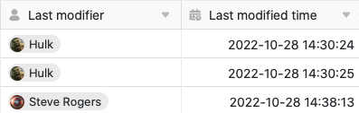
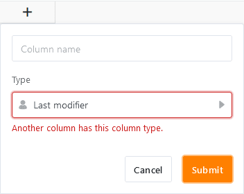

Les colonnes **Dernier éditeur** et **Date de dernière modification** sont exclusivement remplies **automatiquement** par SeaTable et constituent donc des types de colonnes particuliers. Elles sont très utiles si vous souhaitez savoir **quand** et **par qui** une entrée a été **modifiée pour la dernière fois**.

Comme les deux colonnes enregistrent automatiquement les modifications apportées aux entrées, elles conviennent bien, par exemple, comme déclencheurs pour [les automatisations]() et [les tris]().

## Les colonnes Dernier éditeur et Date de dernière modification

Alors que SeaTable remplit la colonne **Dernier éditeur** avec le nom de l'utilisateur qui a modifié une ligne pour la dernière fois, la colonne **Date de dernière modification** enregistre la date et l'heure exacte à laquelle la dernière modification a été effectuée.

## Particularités des deux types de colonnes

- Vous ne pouvez **pas** modifier manuellement les valeurs saisies automatiquement dans les colonnes Dernier éditeur et Date de dernière modification. Les valeurs se mettent à jour d'elles-mêmes dès qu'une modification est apportée à une ligne.
- Lors de la **création** des deux types de colonnes, vous ne disposez d'**aucune** option, à l'exception du nom de la colonne.
- **Une seule** colonne de chaque type peut être créée par tableau. Si vous essayez de créer une autre colonne du même type, le message "Une autre colonne a ce type de colonne" apparaît.

- C'est pourquoi vous ne pouvez **pas dupliquer** les colonnes Dernier éditeur et Date de dernière modification, **ni adapter leur type de colonne**.
