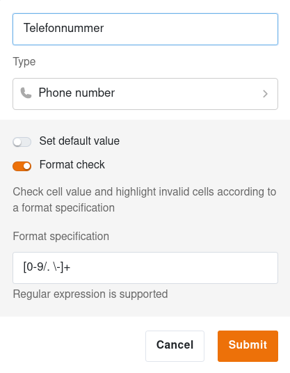
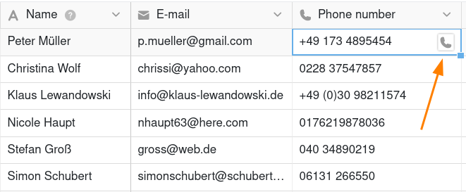

Il existe un type de colonne spécifique dans SeaTable pour la saisie des **numéros de téléphone**. Par rapport à une colonne de texte normale, la colonne de numéro de téléphone présente l'avantage de vous permettre d'**appeler un numéro de téléphone** d'un simple clic de souris.

## Créer une colonne de numéro de téléphone

1. Dans l'en-tête du tableau, cliquez sur l'icône **Plus** à droite de la dernière colonne.
2. Donnez un **nom** à la colonne.
3. Sélectionnez le **type de colonne Numéro de téléphone**.
4. Confirmez en cliquant sur **Envoyer**.

### Définir la valeur par défaut

Vous pouvez définir une [valeur par défaut]() pour chaque colonne de numéro de téléphone. Cette valeur sera automatiquement insérée dans chaque nouvelle ligne du tableau.

### Valider la saisie

Comme pour les colonnes de texte, vous avez la possibilité de valider des entrées pour la colonne de numéro de téléphone. En effectuant une **vérification du format**, vous pouvez mettre en évidence les numéros de téléphone qui diffèrent du format valide. Vous pouvez également utiliser des [expressions régulières]() pour la validation.

## Démarrer les appels

Le type de colonne Numéro de téléphone rend votre communication quotidienne encore plus facile. Un clic sur **l'icône de téléphone dans une cellule** transfère le numéro de téléphone dans votre application de téléphonie. Sur les téléphones portables, cela fonctionne sans aucune configuration supplémentaire. Sur le bureau, il en va de même si un raccourci vers un logiciel de téléphonie est configuré dans le navigateur.

