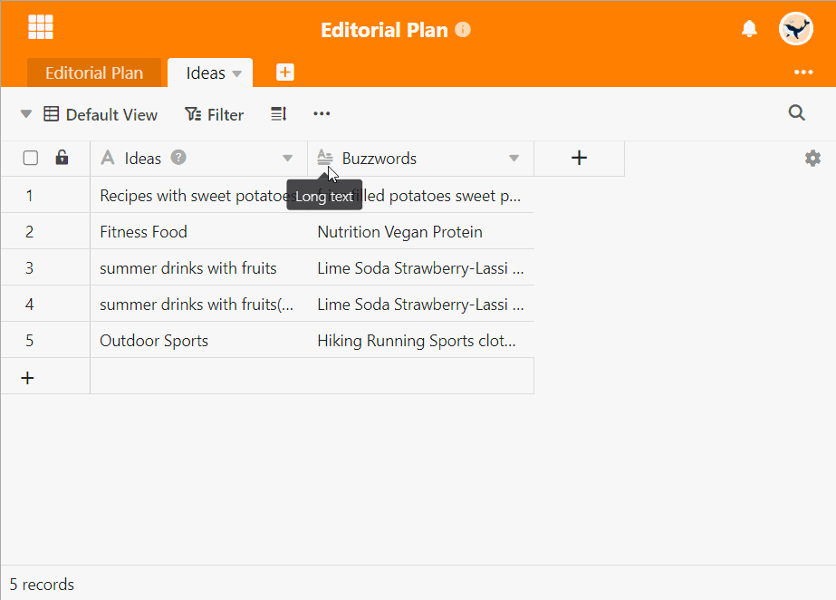

**Las columnas URL** interpretan la información introducida como un recurso de Internet o de la red local y permiten llamar directamente a **los enlaces** haciendo clic. SeaTable añade automáticamente http(s):// como prefijo a la URL si no lo ha introducido.

## Para utilizar la columna URL

1. Cree una columna con el tipo de columna **URL** mediante el **símbolo más**.
2. Inserta una **URL** en una celda de la columna. En cuanto vuelva a seleccionar la **celda**, aparecerá un icono de enlace.
3. Haga clic en el **icono del enlace** para abrir una nueva ventana con la página de Internet deseada.


