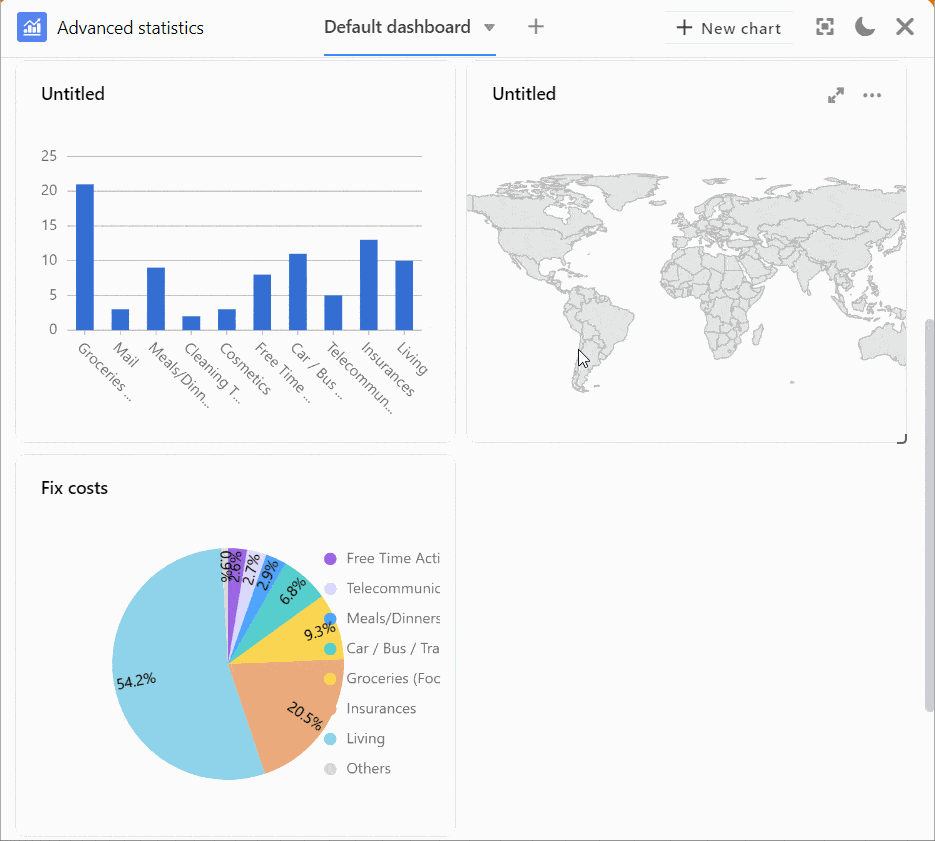
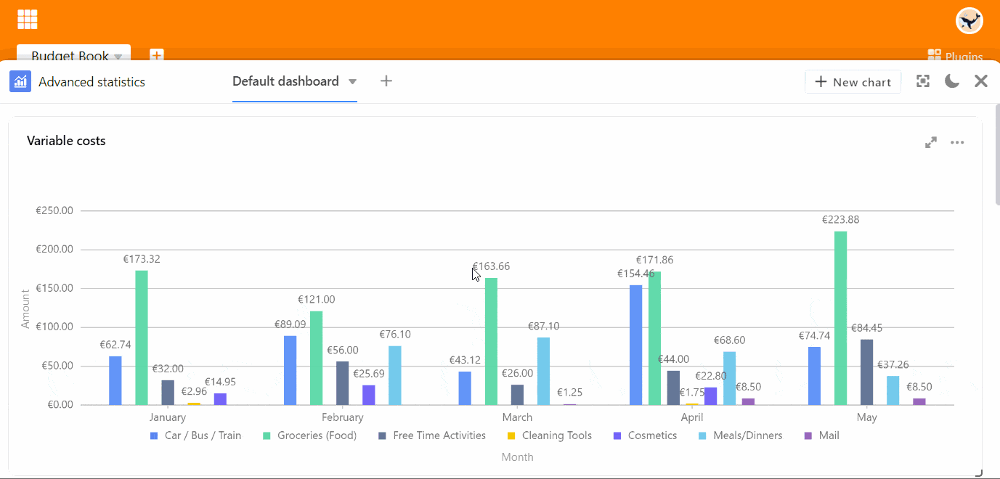

El **módulo de estadísticas** le permite visualizar los datos de su tabla en forma de diversos **gráficos** y **diagramas**. Esto es extremadamente útil para su trabajo en SeaTable: gracias a los **cuadros de mando**, siempre tendrá una visión general de las cifras y la evolución estadística de su base.

## Abrir el módulo de estadísticas

El módulo de estadísticas está configurado por defecto en todas las bases. Siempre puedes acceder a él a través del botón "Estadísticas" de la **cabecera de** la base.

## Crear un gráfico

1. Abra el módulo de estadísticas y pulse el botón  **Nuevo gráfico** en la esquina superior derecha para añadir un nuevo gráfico.

Puede elegir entre distintos **tipos de** gráficos y diagramas. Desplácese por la selección o haga clic en los iconos etiquetados de la barra de opciones para saltar directamente a la ubicación deseada.

4. Seleccione el **tipo** adecuado para sus estadísticas.
5. Ponle un **título** al gráfico. Para ello, haga clic en el **símbolo del lápiz**  e introduzca el nombre deseado.

### Configuración de datos

7. Determine de qué **tabla** y **vista** deben obtener los datos **las** estadísticas.
8. Dependiendo del gráfico, puede realizar diferentes **configuraciones de datos**: para un gráfico de barras, por ejemplo, qué valores desea mostrar en los **ejes X e Y**.

El trabajo detallado en un gráfico de columnas se inicia seleccionando la columna que debe proporcionar los **valores para el eje X**. Haga clic en el campo desplegable correspondiente y seleccione la **columna**. Con un control deslizante puede establecer si desea considerar **filas vacías** en el gráfico.

A continuación, elija cómo se mostrarán los valores en **el eje Y**. Puede elegir entre el **número de** entradas que tienen un determinado valor en la columna seleccionada y la opción del **campo Suma**, donde puede evaluar la suma, la media, el número de valores únicos, el máximo o el mínimo en **columnas numéricas**. Para los gráficos **agrupados** o **apilados**, puede especificar una columna de opciones por la que desee agrupar.

Todos los cambios de ajuste se realizan **en tiempo** real, es decir, el diagrama se **actualiza** inmediatamente **con** cada cambio de ajuste. De este modo, puede ver directamente si ha logrado el resultado deseado o necesita reajustarlo.

### Ajustes de estilo

14. Si el gráfico que ha elegido permite **ajustes de estilo**, puede configurar los **colores** o **las etiquetas de los datos**, por ejemplo.

## Gráficos en el salpicadero

17. Después de cerrar la ventana de configuración, el gráfico guardado aparecerá en tu **panel de control**.

Puede crear **varios cuadros de** mando y crear tantos gráficos como desee en cada uno de ellos. Para cambiar el **orden de los gráficos**, arrástrelos **y suéltelos** en el lugar deseado. Para ello, mueva el puntero del ratón sobre el **título de** un gráfico hasta que aparezca una **cruz en forma de flecha** y mantenga pulsado el **botón del ratón**.

## Opciones para un gráfico

Al mover el puntero del ratón sobre un gráfico, aparecen en la esquina superior derecha los símbolos de una **flecha doble**  y **de tres puntos** . Seleccione la flecha doble para visualizar un gráfico a **pantalla completa**. Puede acceder a todas las demás opciones a través de los tres puntos:

- Editar gráfico
- Copiar gráfico
- Exportar como imagen
- Borrar gráfico

## Otras opciones de visualización

Haciendo clic en  puede visualizar toda la ventana del módulo de estadísticas a **pantalla completa**.

Puede cambiar entre los **modos claro y** oscuro utilizando los símbolos  y .

