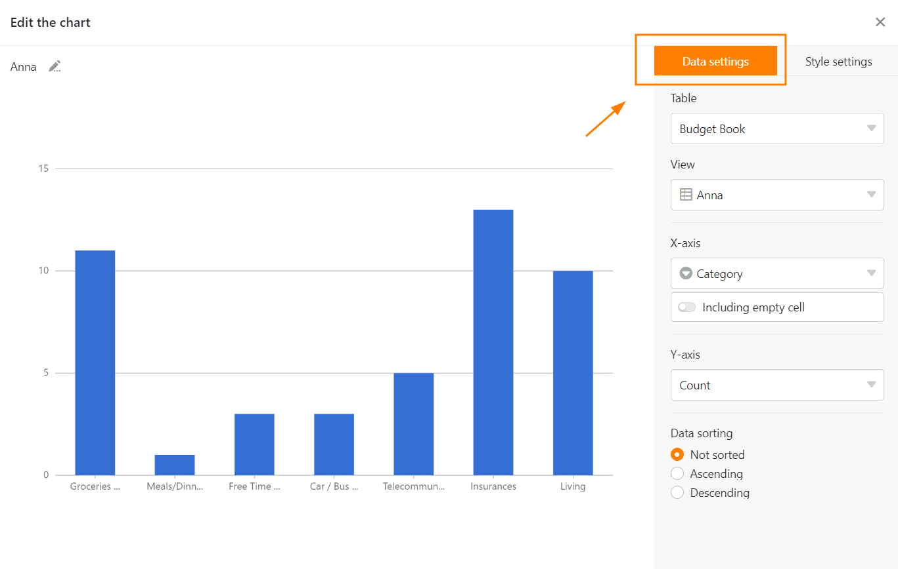

Le **module Statistiques** vous permet de présenter visuellement les données de votre tableau sous la forme de différents **graphiques** et **diagrammes**. Ceci est extrêmement utile pour votre travail dans SeaTable : grâce aux **tableaux de bord**, vous gardez toujours une vue d'ensemble des chiffres et des développements statistiques dans votre base.

## Ouvrir le module de statistiques

Le module de statistiques est installé par défaut dans chaque base. Vous pouvez toujours y accéder en cliquant sur le bouton "Statistiques" dans l **'en-tête de la base**.

## Créer un graphique

1. Ouvrez le module Statistiques et cliquez en haut à droite sur le bouton  **Nouveau graphique** pour ajouter un nouveau graphique.

Vous avez la possibilité de choisir parmi différents **types** de graphiques et de diagrammes. Faites défiler la sélection ou cliquez sur les icônes étiquetées dans la barre d'options pour aller directement à l'endroit souhaité.

4. Choisissez le **type** qui convient à vos statistiques.
5. Donnez un **titre** au graphique. Pour ce faire, cliquez sur le **symbole du crayon**  et saisissez le nom souhaité.

### Paramètres de données

7. Définissez la **table** et **l'affichage** à partir desquels les statistiques doivent obtenir les données.
8. Selon le graphique, vous pouvez définir différents **paramètres de données** - dans le cas d'un diagramme à colonnes, par exemple, quelles valeurs vous souhaitez afficher sur les **axes X et Y**. Vous pouvez également définir le type de graphique que vous souhaitez utiliser.

Vous commencez le travail détaillé sur un diagramme à colonnes en sélectionnant la colonne qui doit fournir les **valeurs pour l'axe des abscisses**. Cliquez sur le champ déroulant correspondant et sélectionnez la **colonne**. Un curseur vous permet de définir si vous souhaitez prendre en compte **les lignes vides** dans le diagramme.

Choisissez ensuite comment les **valeurs** doivent être représentées **sur l'axe des ordonnées**. Vous pouvez choisir entre le **nombre** d'entrées ayant une certaine valeur dans la colonne sélectionnée et l'option **Résumer le champ**, qui vous permet d'évaluer dans des **colonnes numériques** soit la somme, la moyenne, le nombre de valeurs uniques, le maximum ou le minimum. Pour les graphiques **groupés** ou **empilés**, vous pouvez spécifier une colonne d'options en fonction desquelles vous souhaitez grouper.

Toutes les modifications de réglage sont effectuées **en temps réel**, ce qui signifie que le graphique est immédiatement **mis à jour** à chaque modification de réglage. Vous pouvez ainsi voir directement si vous avez obtenu le résultat souhaité ou si vous devez procéder à des ajustements.

### Paramètres de style

14. Si le graphique que vous avez choisi permet **des réglages de style**, vous pouvez par exemple configurer **les couleurs** ou **les étiquettes de données**.

## Graphiques sur le tableau de bord

17. Après avoir fermé la fenêtre des paramètres, le graphique enregistré apparaît sur votre **tableau de bord**.

Vous pouvez créer **plusieurs tableaux de bord** et créer autant de graphiques que vous le souhaitez sur chaque tableau de bord. Pour modifier l'**ordre des graphiques**, il suffit de les **glisser-déposer** à l'endroit souhaité. Pour ce faire, placez le curseur de la souris sur le **titre** d'un graphique jusqu'à ce qu'une **croix fléchée** apparaisse, puis maintenez le **bouton de la souris** enfoncé.

## Options pour un graphique

Lorsque vous passez le curseur de la souris sur un graphique, une **icône** en **forme de double flèche**  et une **icône en forme de trois points**  apparaissent dans le coin supérieur droit. Sélectionnez la double flèche pour afficher un graphique en **mode plein écran**. Vous pouvez accéder à toutes les autres options en cliquant sur les trois points :

- Modifier le graphique
- Copier le graphique
- Exporter en tant qu'image
- Supprimer le graphique

## Autres options d'affichage

En cliquant sur , vous pouvez afficher toute la fenêtre du module Statistiques en **mode plein écran**.

Les icônes  et  permettent de passer du **mode clair au mode sombre**.

