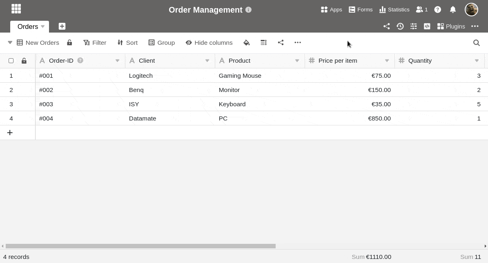

**Модуль статистики** позволяет визуализировать данные из вашей таблицы в виде различных **графиков** и **диаграмм**. Это очень полезно для работы в SeaTable: благодаря **панелям инструментов** вы всегда будете иметь представление о цифрах и статистических изменениях в вашей базе.

## Откройте модуль статистики

Модуль статистики установлен по умолчанию в каждой базе. Вы всегда можете получить доступ к нему через кнопку "Статистика" в **шапке базы**.

## Создайте графику

1. Откройте модуль статистики и нажмите на кнопку  **Новый график** в правом верхнем углу, чтобы добавить новый график.

У вас есть возможность выбирать из различных **типов** графиков и диаграмм. Прокрутите выбор или щелкните по маркированным значкам на панели опций, чтобы перейти непосредственно к нужному месту.

4. Выберите соответствующий **тип** для вашей статистики.
5. Дайте графику **название**. Для этого нажмите на **символ карандаша**  и введите желаемое имя.

### Настройки данных

7. Определите, из какой **таблицы** и **представления** статистики следует получить данные.
8. В зависимости от графика вы можете задать различные **настройки данных** - например, для гистограммы, какие значения вы хотите отобразить на **осях X и Y**.

Детальная работа над столбцовой диаграммой начинается с выбора столбца, в котором будут представлены **значения для оси X**. Щелкните по соответствующему раскрывающемуся полю и выберите **столбец**. С помощью ползунка вы можете установить, нужно ли учитывать **пустые строки** в диаграмме.

Затем выберите способ отображения **значений** на **оси Y**. Вы можете выбрать между **количеством** записей, имеющих определенное значение в выбранном столбце, и опцией **поля Сумма**, где можно оценить сумму, среднее значение, количество уникальных значений, максимум или минимум в **числовых столбцах**. Для **сгруппированных** или **сложенных** диаграмм можно указать столбец параметров, по которым нужно сгруппировать.

Все изменения настроек выполняются **в режиме реального времени**, т.е. диаграмма немедленно **обновляется** при каждом изменении настроек. Таким образом, вы можете непосредственно видеть, достигли ли вы желаемого результата или требуется повторная настройка.

### Настройки стиля

14. Если выбранная вами графика допускает **настройки стиля**, вы можете настроить, например, **цвета** или **метки данных**.

## Графика на приборной панели

17. После того как вы закроете окно настроек, сохраненная графика появится на вашей **приборной панели**.

Вы можете создать **несколько приборных панелей** и создать столько графиков, сколько захотите, на каждой приборной панели. Чтобы изменить **порядок расположения графических элементов**, **перетащите** их в нужное место. Для этого наведите указатель мыши на **заголовок** графики, пока не появится **крестик со стрелкой**, и удерживайте **кнопку мыши**.

## Варианты графики

Когда вы наводите указатель мыши на графику, в правом верхнем углу появляется **символ двойной стрелки**  и **символ трех точек** . Выберите двойную стрелку, чтобы отобразить графику в **полноэкранном режиме**. Доступ ко всем остальным опциям можно получить с помощью трех точек:

- Редактирование графики
- Копировальная графика
- Экспорт в виде изображения
- Удалить графику

## Другие варианты отображения

Щелкнув на , вы можете отобразить все окно модуля статистики в **полноэкранном режиме**.

Переключение между **светлым и темным режимом** осуществляется с помощью символов  и .

