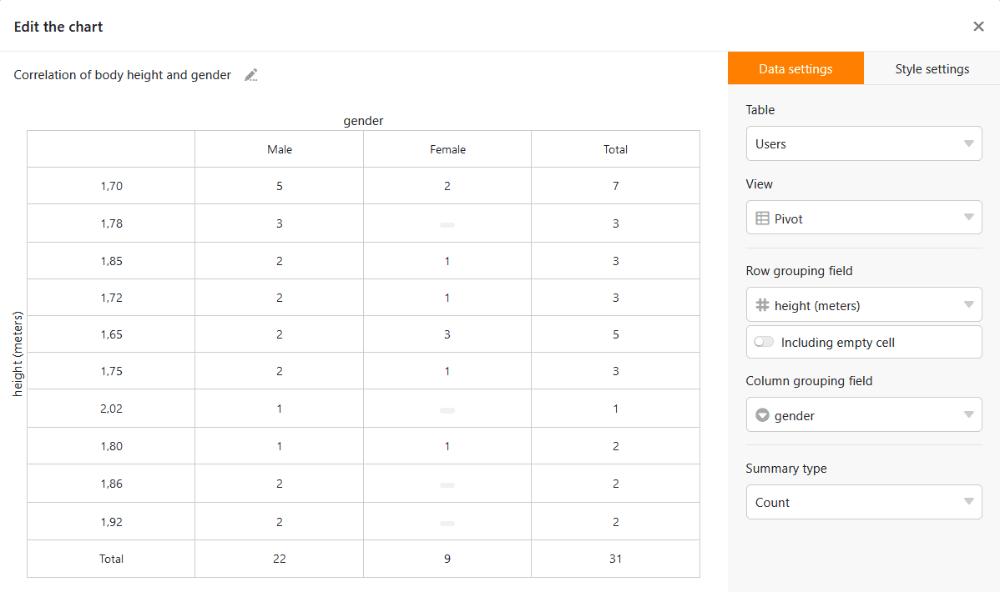

As tabelas dinâmicas são ferramentas de análise poderosas com as quais pode determinar os resultados que procura em poucos segundos, mesmo a partir de conjuntos de dados grandes e confusos. Com o **módulo de estatísticas**, criar tabelas dinâmicas é uma brincadeira de crianças.

## Pré-requisitos para uma tabela dinâmica

Uma tabela pivot é uma **matriz de avaliação** onde os valores da matriz são gerados dinamicamente com base na sua selecção. Ao criar uma tabela pivot, tem três opções de selecção:

- Os valores de que coluna são critérios de agrupamento para as **linhas** da tabela dinâmica a ser gerada?
- Os valores de que coluna são critérios de agrupamento para as **colunas** da tabela dinâmica a ser gerada?
- **Como** devem ser analisados os valores da tabela definidos pelas linhas e colunas?

Para uma tabela pivot, são portanto necessárias pelo menos duas colunas. Teoricamente, também se pode deixar o agrupamento de colunas por especificar. O SeaTable ainda exibirá um resultado, mas os resultados obtidos desta forma podem ser obtidos mais rapidamente utilizando as simples ferramentas de avaliação Agrupamento e Filtro.

## Criar tabelas pivot

1. Abra o **módulo de estatísticas** e clique no botão  **Novo gráfico** no canto superior direito.
2. Clique em **Tabela dinâmica** na barra de opções na extrema direita ou desloque-se para baixo na lista para criar uma nova tabela dinâmica.
3. Primeiro, seleccione a **tabela** relevante e a **vista** relevante no lado direito, depois a coluna para o agrupamento de linhas e a coluna para o agrupamento de colunas.
4. Verá imediatamente uma tabela dinâmica em que os valores da tabela resultam do **número** de entradas: Quantas linhas têm a respectiva caraterística? Com o **campo Compactar**, é possível criar outras análises interessantes com pouco esforço.

6. Finalmente, deve dar um nome à tabela pivot. Fá-lo clicando no **ícone do lápis**  na parte superior esquerda da janela. Use um nome curto e conciso para acompanhar muitas tabelas pivot no seu tablier. Evidentemente, pode adaptar o nome mais tarde.
7. Quando estiver satisfeito com a sua tabela pivot, basta fechar a janela clicando no **símbolo x** no canto superior direito e a tabela pivot que acabou de criar aparecerá no seu tablier. A partir daí, pode chamar, ajustar ou apagar a tabela pivot a qualquer momento.
