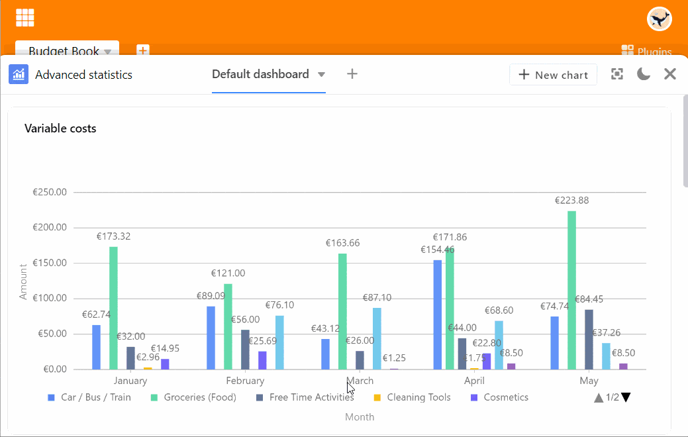
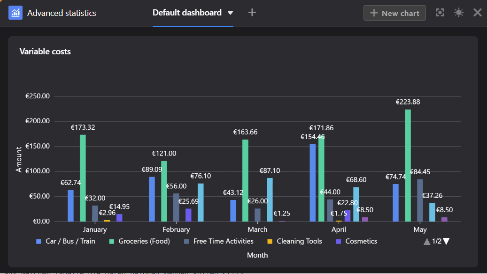

Mit dem **Statistik-Modul** können Sie die Daten aus Ihrer Tabelle visuell in Form von verschiedenen **Grafiken** und **Diagrammen** darstellen. Dies ist für Ihre Arbeit in SeaTable äußerst nützlich: Dank der **Dashboards** behalten Sie immer den Überblick über die Zahlen und statistischen Entwicklungen in Ihrer Base.

## Das Statistik-Modul öffnen

Das Statistik-Modul ist standardmäßig in jeder Base eingerichtet. Sie erreichen es stets über die Schaltfläche "Statistiken" im **Base-Header**.

## Eine Grafik erstellen

1. Öffnen Sie das Statistik-Modul und klicken Sie rechts oben auf die Schaltfläche  **Neue Grafik**, um eine neue Grafik hinzuzufügen.
Sie haben die Möglichkeit, aus verschiedenen **Typen** von Grafiken und Diagrammen auszuwählen. Scrollen Sie durch die Auswahl oder klicken Sie in der Optionsleiste auf die beschrifteten Icons, um direkt an die gewünschte Stelle zu springen.

6. Wählen Sie den passenden **Typ** für Ihre Statistik aus.
7. Geben Sie der Grafik einen **Titel**. Klicken Sie dazu auf das **Stift-Symbol**  und tragen Sie den gewünschten Namen ein.

### Dateneinstellungen

11. Legen Sie fest, aus welcher **Tabelle** und **Ansicht** die Statistik die Daten beziehen soll.
12. Je nach Grafik können Sie unterschiedliche **Dateneinstellungen** vornehmen – bei einem Säulendiagramm zum Beispiel, welche Werte Sie auf der **X- und Y-Achse** darstellen möchten.

Sie beginnen die Detailarbeit an einem Säulendiagramm mit der Auswahl der Spalte, welche die **Werte für die X-Achse** liefern soll. Klicken Sie auf das entsprechende Drop-down-Feld und wählen Sie die **Spalte** aus. Mit einem Regler können Sie einstellen, ob Sie **leere Zeilen** im Diagramm berücksichtigen wollen.

Wählen Sie dann, wie die **Werte auf der Y-Achse** dargestellt werden sollen. Sie können wählen zwischen der **Anzahl** der Einträge, die einen bestimmten Wert in der gewählten Spalte aufweisen, und der Option **Feld zusammenfassen**, bei der Sie in **numerischen Spalten** entweder die Summe, den Durchschnitt, die Anzahl eindeutiger Werte, das Maximum oder das Minimum auswerten können. Bei **gruppierten** oder **gestapelten** Diagrammen können Sie eine Spalte mit Optionen angeben, nach denen Sie gruppieren möchten.

Alle Einstellungsänderungen werden **in Echtzeit** ausgeführt, d.h. das Diagramm wird bei jeder Einstellungsänderung unmittelbar **aktualisiert**. So können Sie direkt sehen, ob Sie das gewünschte Ergebnis erzielt haben oder nachjustieren müssen.

### Stileinstellungen

31. Wenn die von Ihnen gewählte Grafik **Stileinstellungen** erlaubt, können Sie beispielsweise **Farben** oder **Datenbeschriftungen** konfigurieren.

## Grafiken auf dem Dashboard

36. Nachdem Sie das Einstellungsfenster geschlossen haben, erscheint die gespeicherte Grafik auf Ihrem **Dashboard**.

Sie können **mehrere Dashboards** anlegen und auf jedem Dashboard beliebig viele Grafiken erstellen. Um die **Reihenfolge der Grafiken** zu ändern, ziehen Sie diese **per Drag-and-Drop** an die gewünschte Stelle. Fahren Sie dazu mit dem Mauszeiger über den **Titel** einer Grafik, bis ein **Pfeilkreuz** angezeigt wird, und halten Sie die **Maustaste** gedrückt.

## Optionen für eine Grafik

Wenn Sie mit dem Mauszeiger über eine Grafik fahren, erscheinen in der rechten oberen Ecke ein **Doppelpfeil-Symbol**  und ein **Drei-Punkte-Symbol** . Wählen Sie den Doppelpfeil aus, um eine Grafik im **Vollbildmodus** anzuzeigen. Auf alle anderen Optionen können Sie über die drei Punkte zugreifen:

- Grafik bearbeiten
- Grafik kopieren
- Als Bild exportieren
- Grafik löschen

## Weitere Anzeige-Optionen

Per Klick auf  können Sie sich das gesamte Fenster des Statistik-Moduls im **Vollbildmodus** anzeigen lassen.

Über die Symbole  und  können Sie zwischen **hellem und dunklem Modus** wechseln.

