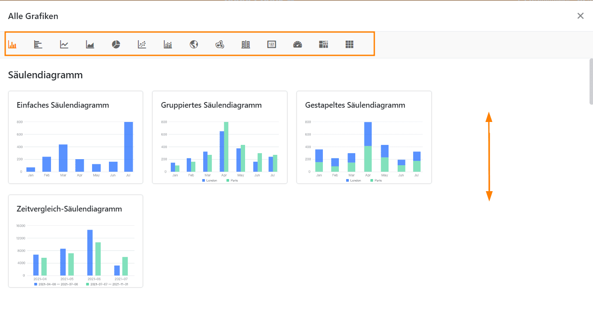
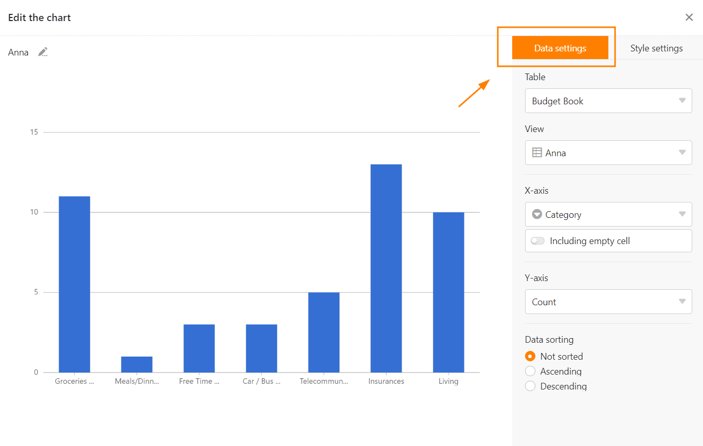
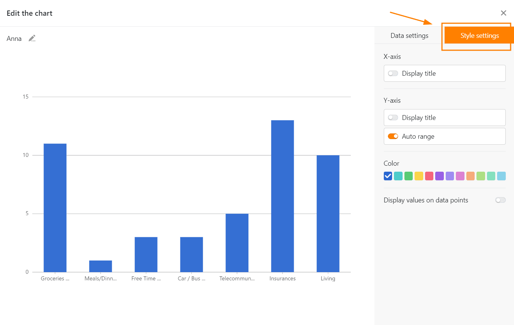
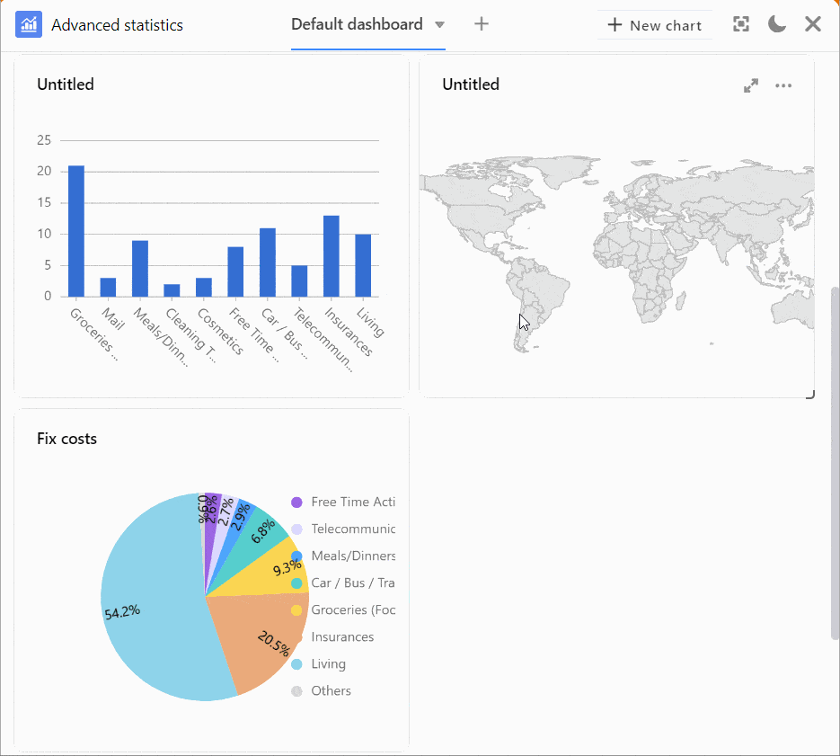
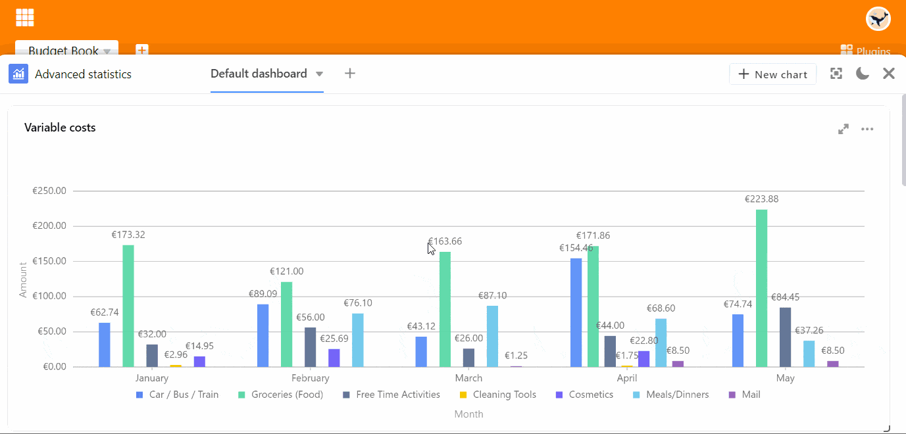
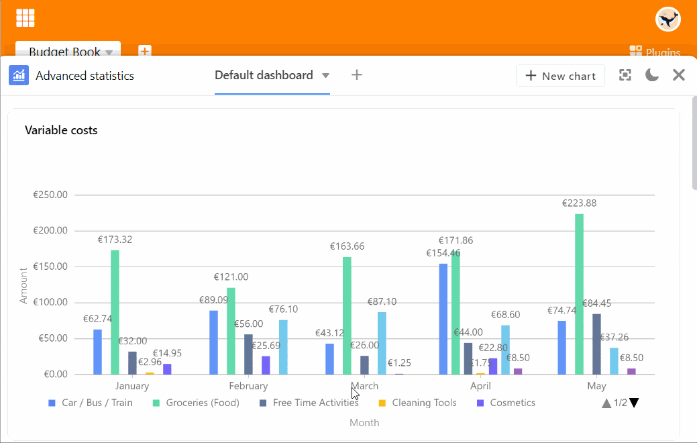
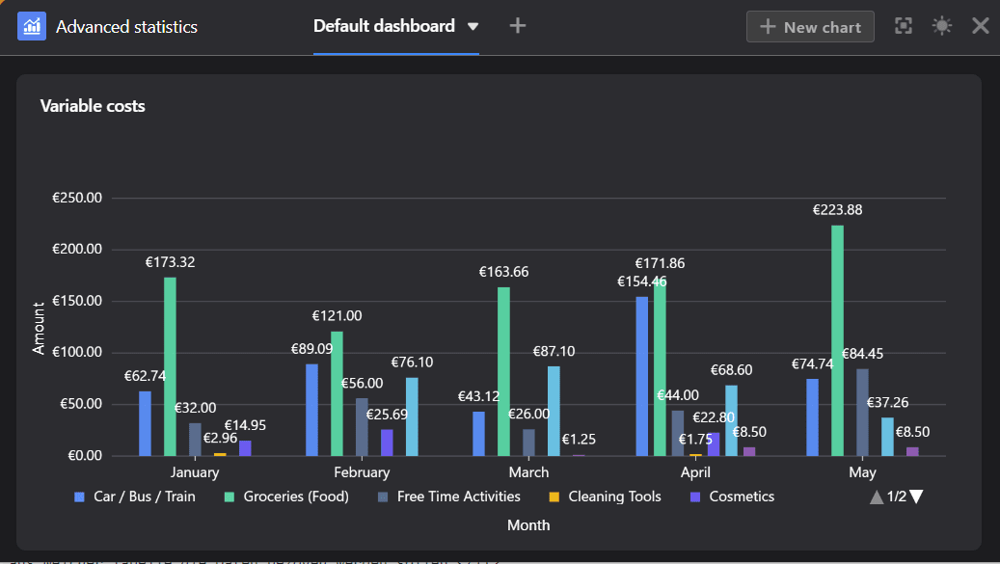

With the **statistics module**, you can display the data from your table visually in the form of various **graphs** and **charts**. This is extremely useful for your work in SeaTable: thanks to the **dashboards**, you always have an overview of the figures and statistical developments in your base.

## Open the statistics module

The statistics module is set up by default in every base. You can always access it via the "Statistics" button in the **base header**.

## Create a graphic

1. Open the statistics module and click on the button  **New chart** in the top right-hand corner to add a new chart.

You have the option to choose from different **types of** graphs and charts. Scroll through the selection or click on the labeled icons in the options bar to jump directly to the desired location.

4. Select the appropriate **type** for your statistics.
5. Give the graphic a **title**. To do this, click on the **pencil icon**  and enter the desired name.

### Data settings

7. Specify from which **table** and **view the** statistics should obtain the data.
8. Depending on the graph, you can make different **data settings** - for a bar chart, for example, which values you want to display on the **X and Y axes**.

You start the detailed work on a column chart by selecting the column that will provide the **values for the X-axis**. Click on the corresponding drop-down field and select the **column**. You can use a slider to set whether you want to include **empty rows** in the chart.

Then choose how you want the **values** to be displayed on the **Y-axis**. You can choose between the **number of** entries that have a certain value in the selected column and the **Sum field** option, where you can evaluate either the sum, average, number of unique values, maximum or minimum in **numeric columns**. For **grouped** or **stacked** charts, you can specify a column with options by which you want to group.

All setting changes are executed **in real time**, i.e. the diagram is **updated** immediately with every setting change. This allows you to see directly whether you have achieved the desired result or need to readjust.

### Style settings

14. If the graphic you selected allows **style settings**, you can configure **colors** or **data labels**, for example.

## Graphics on the dashboard

17. After you close the settings window, the saved graphic will appear on your **dashboard**.

You can create **multiple dashboards** and create as many graphics as you want on each dashboard. To change the **order of the graphics**, drag **and drop** them to the desired location. To do this, hover the mouse pointer over the **title of** a graphic until an **arrow cross** appears and hold down the mouse **button**.

## Options for a graphic

When you hover over a graphic, a **double-arrow icon**  and a **three-dot icon**  appear in the upper right corner. Select the double arrow to display a graphic in **full screen mode**. You can access all other options using the three dots:

- Edit graphic
- Copy graphic
- Export as image
- Delete graphic

## More display options

By clicking on  you can display the entire window of the statistics module in **full screen mode**.

You can switch between **light and dark mode** using the  and  icons.

