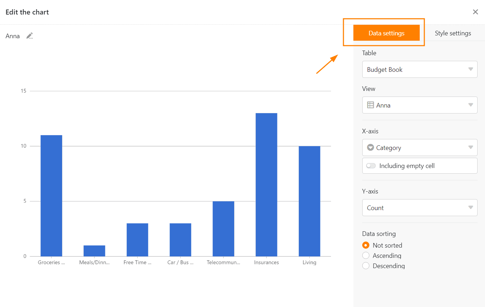

O **módulo de estatísticas** permite-lhe visualizar os dados da sua tabela sob a forma de vários **gráficos** e **diagramas**. Isto é extremamente útil para o seu trabalho no SeaTable: graças aos **painéis de controlo**, tem sempre uma visão geral dos números e da evolução estatística da sua base.

## Abrir o módulo de estatísticas

O módulo de estatísticas é configurado por defeito em todas as bases. Pode sempre aceder-lhe através do botão "Estatísticas" no **cabeçalho da base**.

## Criar um gráfico

1. Abra o módulo de estatísticas e clique no botão  **Novo gráfico** no canto superior direito para adicionar um novo gráfico.

Tem a opção de escolher entre diferentes **tipos de** gráficos e gráficos. Percorrer a selecção ou clicar nos ícones rotulados na barra de opções para saltar directamente para o local desejado.

4. Seleccione o **tipo** apropriado para as suas estatísticas.
5. Dê um **título** ao gráfico. Para o fazer, clicar no **símbolo do lápis**  e introduzir o nome desejado.

### Definições de dados

7. Determinar de que **tabela** e **visualizar as** estatísticas devem obter os dados.
8. Dependendo do gráfico, pode fazer diferentes **configurações de dados** - para um gráfico de barras, por exemplo, quais os valores que deseja exibir nos **eixos X e Y**.

Inicia-se o trabalho detalhado num gráfico de colunas, seleccionando a coluna que deve fornecer os **valores para o eixo X**. Clique no campo pendente correspondente e seleccione a **coluna**. Com um selector pode definir se pretende considerar **linhas vazias** no gráfico.

Depois escolher como os **valores** devem ser exibidos no **eixo Y**. Pode escolher entre o **número de** entradas que têm um determinado valor na coluna seleccionada e a opção de **campo Soma**, onde pode avaliar quer a soma, média, número de valores únicos, máximo ou mínimo em **colunas numéricas**. Para gráficos **agrupados** ou **empilhados**, pode especificar uma coluna de opções pelas quais pretende agrupar.

Todas as alterações de configuração são efectuadas **em tempo real**, ou seja, o diagrama é imediatamente **actualizado** com cada alteração de configuração. Desta forma é possível ver directamente se se atingiu o resultado desejado ou se é necessário reajustar.

### Definições de estilo

14. Se o gráfico escolhido permitir **configurações de estilo**, pode configurar **cores** ou **etiquetas de dados**, por exemplo.

## Gráficos no Painel de instrumentos

17. Depois de fechar a janela de definições, o gráfico guardado aparece no seu **painel de instrumentos**.

Pode criar **vários painéis de instrumentos** e criar quantos gráficos quiser em cada painel. Para alterar a **ordem dos gráficos**, arraste-os **e largue-os** para o local desejado. Para o fazer, mover o ponteiro do rato sobre o **título de** um gráfico até aparecer uma **seta cruzada** e manter premido o **botão** do rato.

## Opções para um gráfico

Quando se move o ponteiro do rato sobre um gráfico, aparece no canto superior direito um **símbolo de seta dupla**  e um **símbolo de três pontos** . Seleccionar a seta dupla para exibir um gráfico em **modo de ecrã inteiro**. Pode aceder a todas as outras opções através dos três pontos:

- Editar gráfico
- Copiar gráfico
- Exportar como imagem
- Apagar gráfico

## Outras opções de visualização

Se clicar em , pode visualizar toda a janela do módulo de estatísticas em **modo de ecrã inteiro**.

Pode alternar entre o **modo claro e escuro** usando os ícones  e .

