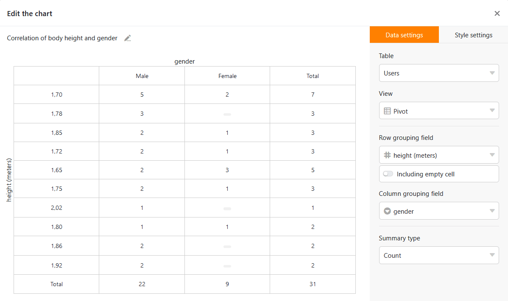

Pivot tables are powerful analysis tools with which you can determine the results you are looking for within a few seconds, even from large, confusing data sets. With the **statistics module**, creating pivot tables is child's play.

## Prerequisites for a pivot table

A pivot table is an **evaluation matrix** where the matrix values are dynamically generated based on your selection. When creating a pivot table, you have three selection options:

- The values of which column are grouping criteria for the **rows** of the pivot table to be generated?
- The values of which column are grouping criteria for the **columns** of the pivot table to be generated?
- **How** should the values in the table defined by the rows and columns be evaluated?

Therefore, for a pivot table you need at least two columns. Theoretically, you can also leave the column grouping unspecified. SeaTable will still display a result, but the results obtained in this way can be obtained more quickly using the simple evaluation tools Grouping and Filter.

## Create pivot tables

1. Open the **statistics module** and click on the button  **New chart** in the top right-hand corner.
2. Click on **Pivot table** in the options bar on the far right or scroll all the way down in the list to create a new pivot table.
3. First select the relevant **table** and the relevant **view** on the right-hand side, then the column for the row grouping and the column for the column grouping.
4. You will immediately see a pivot table in which the table values result from the **number** of entries: How many rows have the respective characteristic? With **Summarize field** you can create further interesting evaluations with little effort.

6. Finally, you should give the pivot table a name. You do this by clicking on the **pencil icon**  at the top left of the window. Use a short, concise name to keep track of many pivot tables on your dashboard. Of course, you can customize the name later.
7. When you are satisfied with your pivot table, simply close the window by clicking on the **x icon** in the upper right corner and the pivot table you just created will appear on your dashboard. From there you can recall, adjust or delete the pivot table at any time.
