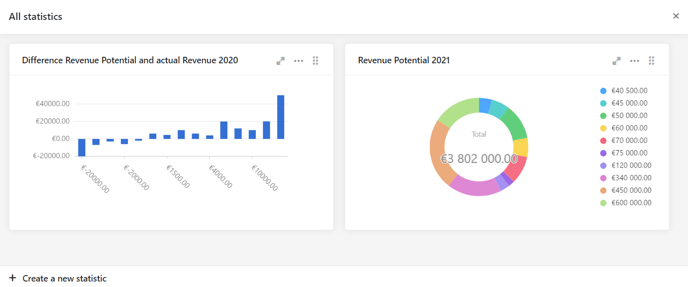

Dank der Auswertungswerkzeuge **Filter, Sortierung und Gruppierung** lassen sich einfache Analysen mit wenigen Klicks ausführen. SeaTable kennt zudem verschiedene **Operationen zur Datenverarbeitung**, mit denen Sie beispielsweise kumulierte Werte errechnen oder Ranglisten erstellen können. Für detaillierte Auswertungen mit Pivot-Tabellen, Diagrammen und grafischen Darstellungen bietet SeaTable das **Statistik-Modul**.

Wie Sie mit SeaTable statistische Auswertungen und ansprechende Grafiken erstellen können, lernen Sie in diesem Artikel.

## Filter, Sortierung und Gruppierung

Mit [Filtern, Gruppierungen und Sortierungen]() bringen Sie in Windeseile Ordnung Ihre Daten und bereiten sie für Ihre verschiedenen Anwendungsfälle auf. Durch die Kombination dieser einfachen Analysewerkzeuge, die Sie zentral in jeder Tabellenansicht finden, werden auch große Datenmengen strukturiert und überschaubar. Sie können unterschiedliche [Ansichten](
) speichern, um später auf diese zurückzugreifen.

An der [Status-Zeile]() können Sie dabei die **Zeilenanzahl** in einer Ansicht und bestimmte **Spaltenwerte** ablesen. Zur Auswahl stehen die Summe, der Durchschnitt, der Median, das Maximum oder das Minimum aus allen Werten in einer Spalte. Diese Spaltenwerte können Sie ebenso für einzelne Gruppierungen ermitteln.

## Operationen zur Datenverarbeitung

Mithilfe der [Datenverarbeitungsfunktion]() können Sie diverse **Operationen** durchführen. Dabei können Sie sowohl **mathematische Berechnungen** über alle Werte einer Spalte hinweg vornehmen als auch Werte miteinander in Beziehung setzen, wenn Einträge in zwei verschiedenen Tabellen identisch sind. Nützliche statistische Auswertungen sind zum Beispiel **kumulierte Werte**, **prozentuale Anteile** oder **Ranglisten**.

## Statistiken

Für umfangreichere Datenauswertungen bietet SeaTable Ihnen verschiedene Statistiken. Wie bei den Ansichten können Sie Ihre statistischen Auswertungen natürlich festhalten, um in Zukunft jederzeit darauf zurückzugreifen.

Mit dem [Statistik-Modul](https://seatable.io/docs/plugins/anleitung-zum-statistik-plugin/) können Sie Daten in **Diagrammen** visualisieren oder mittels **Pivot-Tabellen** detailliert auswerten. In jeder Base können Sie eine beliebige Anzahl solcher Auswertungen erstellen und speichern.

Die Verwaltung von Diagrammen und Pivot-Tabellen erfolgt auf dem Dashboard des Statistik-Moduls. Alle erstellten Diagramme und Pivot-Tabellen werden dort gespeichert und stehen jederzeit für den erneuten Abruf bereit. Alle bestehenden Statistiken werden **automatisch aktualisiert**, wenn Sie Daten in der Tabelle ändern. Sie müssen also nie an die Aktualisierung der Statistiken denken – das macht SeaTable für Sie!

Die im Statistik-Modul angezeigten Auswertungen beziehen sich immer auf **eine Tabelle** in der geöffneten Base. Die Datengrundlage für die Visualisierung und Auswertung legen Sie durch die Wahl der anzuwendenden **Ansicht** fest. Wenn Sie ein Diagramm oder eine Pivot-Tabelle nur für einen **Teil der Daten** in einer Tabelle erstellen wollen, dann legen Sie eine geeignete Ansicht an. Im Statistik-Modul selbst werden Sie keine **Filterfunktionen** finden. Aus diesem Grund müssen Sie vor der Erstellung einer Statistik immer die relevanten Daten in einer Ansicht definieren.

Das Statistik-Modul unterstützt eine Vielzahl an **Diagrammtypen**, zum Beispiel:

- Balken- und Säulendiagramme (für die Darstellung von Häufigkeitsverteilungen)
- Liniendiagramme (für die die Darstellung eines Werts im zeitlichen Verlauf)
- Kuchendiagramme (für die einfache Visualisierung von Anteilen)

Nehmen Sie die [Anleitung zum Statistik-Modul](https://seatable.io/docs/plugins/anleitung-zum-statistik-plugin/) zur Hand, um Schritt für Schritt **ein neues Diagramm zu erstellen**. Aufgrund der Einfachheit mancher Diagrammtypen sind dort die Einstellungsmöglichkeiten im Vergleich zu den anderen Typen begrenzt.
