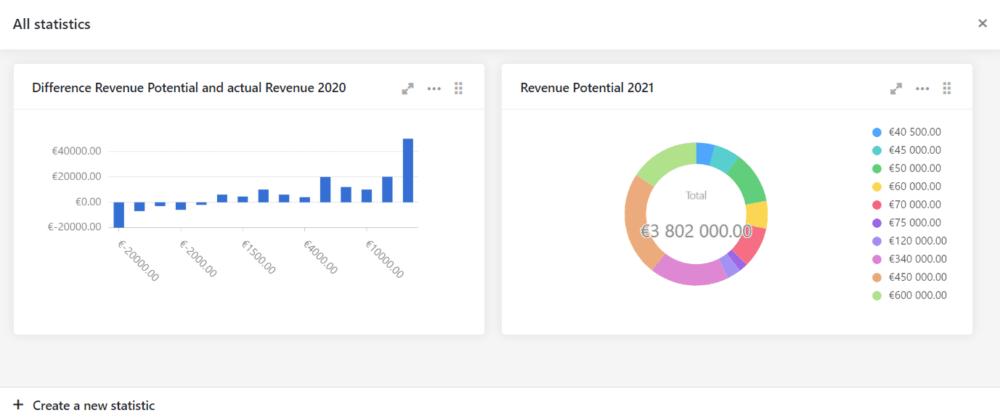

Grâce aux outils d'évaluation que sont les **filtres, les tris et les regroupements**, il est possible d'effectuer des analyses simples en quelques clics. SeaTable connaît en outre différentes **opérations de traitement des données**, qui permettent par exemple de calculer des valeurs cumulées ou de créer des classements. Pour des analyses détaillées avec des tableaux croisés dynamiques, des diagrammes et des représentations graphiques, SeaTable propose le **module Statistiques**.

Dans cet article, vous apprendrez comment créer des analyses statistiques et des graphiques attrayants avec SeaTable.

## Filtrer, trier et grouper

Les [filtres, les regroupements et les tris]() afin de pouvoir y accéder ultérieurement.

La [ligne d'état]() indique le **nombre de lignes** dans une vue et certaines **valeurs de colonne**. Vous pouvez choisir entre la somme, la moyenne, la médiane, le maximum ou le minimum de toutes les valeurs d'une colonne. Vous pouvez également déterminer ces valeurs de colonne pour des regroupements individuels.

## Opérations de traitement des données

La [fonction de traitement des données]() vous permet d'**effectuer** diverses **opérations**. Vous pouvez effectuer des **calculs mathématiques** sur toutes les valeurs d'une colonne ou établir une relation entre les valeurs lorsque les entrées sont identiques dans deux tableaux différents. Les analyses statistiques utiles sont par exemple **les valeurs cumulées**, les **pourcentages** ou **les classements**.

## Statistiques

Pour des analyses de données plus complètes, SeaTable vous propose différentes statistiques. Comme pour les vues, vous pouvez bien sûr enregistrer vos analyses statistiques afin de pouvoir y accéder à tout moment à l'avenir.

Le [module Statistiques](https://seatable.io/fr/docs/plugins/anleitung-zum-statistik-plugin/) vous permet de visualiser des données dans des **diagrammes** ou de les évaluer en détail au moyen de **tableaux croisés dynamiques**. Dans chaque base, vous pouvez créer et enregistrer autant d'évaluations de ce type que vous le souhaitez.

La gestion des diagrammes et des tableaux croisés dynamiques se fait sur le tableau de bord du module Statistiques. Tous les diagrammes et tableaux croisés dynamiques créés y sont enregistrés et sont disponibles à tout moment pour une nouvelle consultation. Toutes les statistiques existantes sont **automatiquement mises à jour** lorsque vous modifiez des données dans le tableau. Vous ne devez donc jamais penser à mettre à jour vos statistiques - SeaTable le fait pour vous !

Les évaluations affichées dans le module Statistiques se réfèrent toujours à **un tableau** dans la base ouverte. Vous déterminez la base de données pour la visualisation et l'évaluation en choisissant la **vue** à appliquer. Si vous souhaitez créer un graphique ou un tableau croisé dynamique uniquement pour une **partie des données** d'un tableau, créez une vue appropriée. Vous ne trouverez pas **de fonctions de filtrage** dans le module Statistiques lui-même. C'est pourquoi vous devez toujours définir les données pertinentes dans une vue avant de créer une statistique.

Le module Statistiques prend en charge un grand nombre de **types de graphiques**, par exemple

- Diagrammes à barres et à colonnes (pour la représentation des distributions de fréquences)
- Diagrammes linéaires (pour la représentation d'une valeur dans le temps)
- Diagrammes en camembert (pour une visualisation simple des proportions)

Consultez les [instructions du module Statistiques](https://seatable.io/fr/docs/plugins/anleitung-zum-statistik-plugin/) pour **créer un nouveau graphique** étape par étape. En raison de la simplicité de certains types de diagrammes, les possibilités de réglage y sont limitées par rapport aux autres types.
