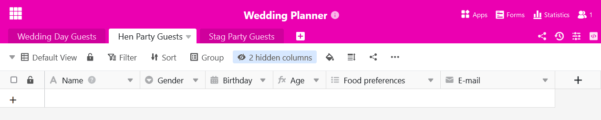

Do you need a table in your base several times in a slightly modified form? Then you can duplicate it with just a few mouse clicks. It's that simple:

1. In the base header, you will find all the tables in the base displayed as **tabs** at the top left.
2. Click on the **drop-down icon** next to **the name of the table** you wish to duplicate.

4. Click on **Duplicate table**.
5. Decide whether the table should be duplicated **empty or with entries** by activating the slider.

7. Confirm with **Submit**.



All views are also duplicated with all [view settings]() so that the copied table is an exact copy of the original table.



**This is what the result looks like with duplicated entries**

This option is useful if you want to transfer at least some of the rows from the original table.

**This is what the result looks like without duplicated entries**

This option is useful if you only want to adopt the **structure** of the original table, but want to fill it with other entries. This can happen, for example, if you create one table per year for your [budget planning]().
