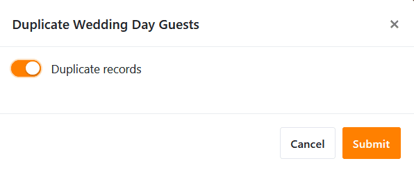

Vous avez besoin d'un tableau dans votre base plusieurs fois sous une forme légèrement modifiée ? Vous pouvez alors le dupliquer en quelques clics de souris. C'est aussi simple que cela :

1. Dans l'en-tête de la base, vous trouverez en haut à gauche tous les tableaux de la base représentés sous forme d'**onglets**.
2. Cliquez sur l'**icône déroulante** à côté du **nom du tableau** que vous souhaitez dupliquer.

4. Cliquez sur **Dupliquer le tableau**.
5. Décidez si le tableau doit être **vide ou** dupliqué **avec des entrées** en activant le curseur.

7. Confirmez en cliquant sur **Envoyer**.



**Voici à quoi ressemble le résultat avec des entrées dupliquées**

Cette option est utile si vous souhaitez reprendre au moins une partie des lignes du tableau initial.

**Voici à quoi ressemble le résultat sans les entrées dupliquées**

Cette option est utile si vous ne reprenez que la **structure** du tableau initial, mais que vous souhaitez le remplir avec d'autres entrées. Cela peut par exemple se produire si vous créez un tableau par année pour votre [planification budgétaire](https://seatable.io/fr/budgetplanung-vorlage/).
