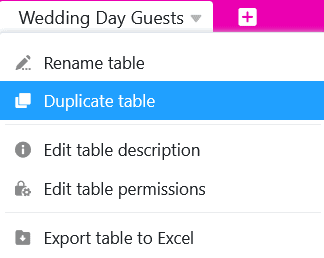
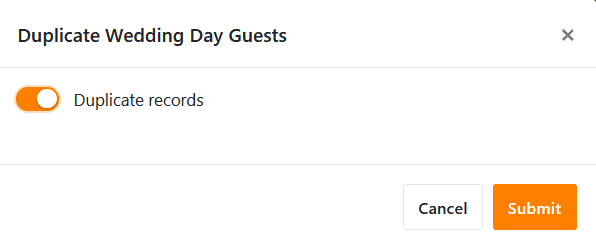

Precisa de uma tabela na sua Base várias vezes com uma forma ligeiramente diferente? Então pode duplicá-la com apenas alguns cliques no rato. É simples assim:

1. No cabeçalho da base, encontrará todas as tabelas da base apresentadas como **separadores** no canto superior esquerdo.
2. Clique no **ícone de lista pendente** junto ao **nome da tabela** que pretende duplicar.

4. Clique em **Duplicar tabela**.
5. Decida se a tabela deve ser duplicada **vazia ou com entradas**, activando o cursor.

7. Confirmar com **Submeter**.



Todas as vistas são também duplicadas com todas as [definições de vista]() para que a tabela copiada seja uma cópia exacta da tabela original.



**Este é o aspeto do resultado com entradas duplicadas**

Esta opção é útil se pretender copiar pelo menos algumas das linhas da tabela original.

**Este é o aspeto do resultado sem entradas duplicadas**

Essa opção é útil se o usuário deseja apenas adotar a **estrutura** da tabela original, mas deseja preenchê-la com outras entradas. Isso pode ocorrer, por exemplo, se for criada uma tabela por ano para o [planejamento do orçamento]().
