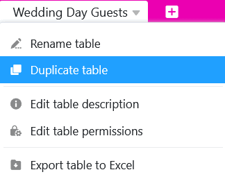
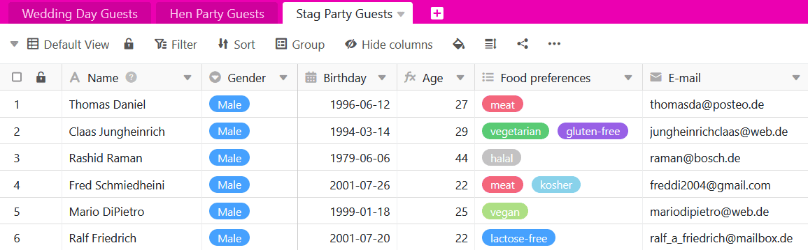

Вам нужно, чтобы таблица в вашей базе несколько раз использовалась в несколько ином виде? Тогда вы можете продублировать ее всего несколькими щелчками мыши. Это так просто:

1. В заголовке базы вы найдете все таблицы базы, отображаемые в виде **вкладок** в левом верхнем углу.
2. Нажмите на **раскрывающийся значок** рядом с **названием таблицы**, которую нужно продублировать.

4. Нажмите на кнопку **Дублировать таблицу**.
5. Чтобы решить, дублировать ли таблицу **пустой или с записями**, активируйте ползунок.

7. Подтвердите с помощью кнопки **Отправить**.



**Вот как выглядит результат с дублированными записями**

Эта опция полезна, если вы хотите скопировать хотя бы часть строк из исходной таблицы.

**Вот как выглядит результат без дублированных записей**

Этот вариант удобен, если вы хотите сохранить только **структуру** исходной таблицы, но заполнить ее другими записями. Это может произойти, например, если вы создаете одну таблицу на год для [планирования бюджета](https://seatable.io/ru/budgetplanung-vorlage/).
