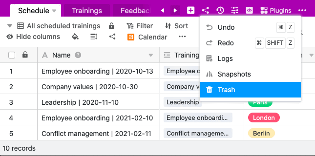
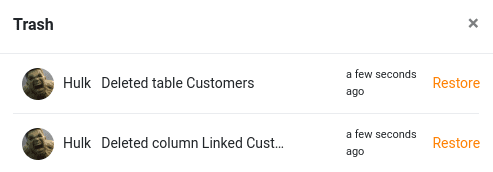

In SeaTable brauchen Sie keine Angst vor dem Verlust Ihrer Daten zu haben. Selbst versehentlich gelöschte Tabellen – und sogar einzelne Spalten und Zeilen – können Sie im Nachhinein einfach über den **Papierkorb** in den **Base-Optionen** wiederherstellen.

## Eine gelöschte Tabelle wiederherstellen

4. Klicken Sie oben rechts in den Base-Optionen auf **Versionen**.
5. Öffnen Sie den **Papierkorb**.
6. Ihnen werden nun alle **Tabellen**, **Zeilen** und **Spalten** angezeigt, die innerhalb dieser Base in der Vergangenheit gelöscht worden sind.
7. Wählen Sie die gewünschte **Tabelle** aus, die Sie wiederherstellen möchten, und klicken Sie rechts neben dem Löschzeitpunkt auf **Wiederherstellen**.
8. Die ausgewählte Tabelle wird anschließend automatisch wieder Ihrer **Base** hinzugefügt.

## Tabelleninhalte, die wiederhergestellt werden

Wenn Sie eine Tabelle aus dem Papierkorb holen, wird diese genauso wiederhergestellt, wie sie zum Zeitpunkt des Löschens aussah. Dies beinhaltet folgende Bestandteile:

- Tabellendaten
- [Tabellenansichten]()
- [Kommentare]()
- [Webformulare]()
- Automationen
- Darstellungen und Auswertungen in den Plugins von SeaTable

{{< warning type="warning" headline="Verlinkungen auf die gelöschte Tabelle müssen separat wiederhergestellt werden" text="Eine der Stärken von SeaTable ist die Fähigkeit, Tabellen miteinander zu verknüpfen. Wenn Sie eine Tabelle löschen, dann verschwinden alle Verlinkungsspalten, die diese gelöschte Tabelle als Ziel hatten. Wenn Sie nun die ursprüngliche Tabelle wiederherstellen, werden die Verlinkungsspalten zwar nicht automatisch wieder angelegt, aber auch diese können aus dem Papierkorb wiederhergestellt werden. Es gehen somit keine Informationen verloren." />}}

## Weitere hilfreiche Artikel rund um die Wiederherstellung von Daten

SeaTable bietet verschiedene Möglichkeiten, um gelöschte Inhalte wiederherzustellen. So lassen sich nicht nur gelöschte Tabellen, sondern auch Ihre letzten Änderungen, alte Versionsstände oder ganze Bases wiederherstellen. Der [Übersichtsartikel zur Datenwiederherstellung in SeaTable]() hilft Ihnen bestimmt weiter.
