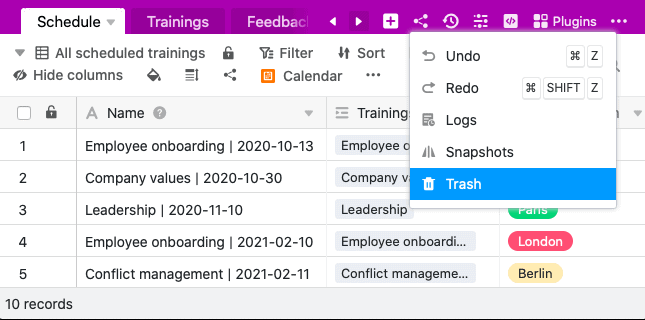
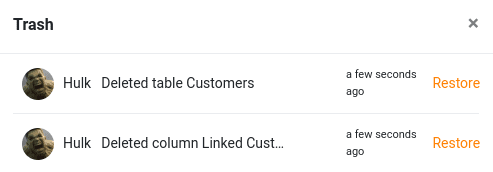

В SeaTable вам не нужно беспокоиться о потере данных. Даже случайно удаленные таблицы - и даже отдельные столбцы и строки - могут быть легко восстановлены после этого через **корзину** в **базовых опциях**.

## Восстановление удаленной таблицы

2. Нажмите на **Версии** в правом верхнем углу опций базы.
3. Откройте **корзину**.
4. Теперь вы увидите все **таблицы**, **строки** и **столбцы**, которые были удалены в этой базе в прошлом.
5. Выберите нужную **таблицу**, которую вы хотите восстановить, и нажмите кнопку **Восстановить** справа от времени удаления.
6. Затем выбранный стол автоматически добавляется обратно в вашу **базу**.

## Восстанавливаемое содержимое таблицы

Когда вы извлекаете таблицу из корзины, она восстанавливается в том виде, в котором она выглядела при удалении. Сюда входят следующие компоненты:

- Данные таблицы
- [Виды таблиц](https://seatable.io/ru/docs/seatable-nutzen/ansichten/)
- [Комментарии](https://seatable.io/ru/docs/zusammenarbeit/kommentare/)
- [Веб-формы](https://seatable.io/ru/docs/seatable-nutzen/webformulare/)
- Автоматизация
- Представления и оценки в плагинах SeaTable



## Больше полезных статей о восстановлении данных

SeaTable предлагает различные варианты восстановления удаленного содержимого. Можно восстановить не только удаленные таблицы, но и последние изменения, старые версии или целые базы. [Обзорная статья о восстановлении данных в SeaTable](https://seatable.io/ru/docs/historie-und-versionen/moeglichkeiten-der-datenwiederherstellung/) обязательно поможет вам.
