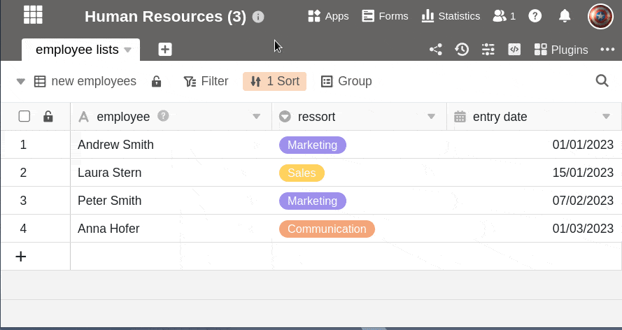

Bases consist of one or more tables, which in turn can hold very different data and link to each other. A base can contain **up to 200 tables**. For the sake of clarity, however, you should consider splitting the tables into several bases and synchronizing the data with the [common datasets]() function if you have more than 20 tables.

## Add a table in a base

1. In the **opened base** you will see in the upper left corner the tabs with all the **Tables** of the base.

    

2. Click the **\[+\] symbol** to the right of the last table tab.
3. Now select **Add table**.
4. Give the new table a **name** and confirm with **Send**.

## Import table from a file

Alternatively, you can also import tables from **files** into your base. The import takes place as a [CSV file](#tabelle_importieren).

## Import table from another base

In SeaTable, [bases]() are basically separate entities, but it is not uncommon to need data in another base as well. Instead of having to export a table from one base and import it into the desired base, SeaTable offers the convenient option of **importing** tables **directly** from other bases and thus transferring data across base boundaries.

[Common datasets]() also allow you to share a master table in a group and use and synchronize the table offshoots in different bases. You can learn more about this [here]().

## Keep the overview

Sometimes a picture is worth a thousand words. SeaTable also allows you to use emojis in the table name, making the table tabs shorter.

You can find detailed instructions in the article [Using emojis in table names]().
