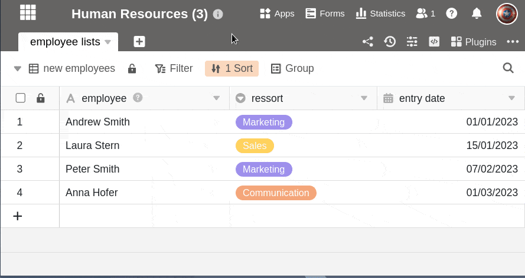

Базы состоят из одной или нескольких таблиц, которые, в свою очередь, могут содержать совершенно разные данные и связываться друг с другом. База может содержать до **200 столов**. Однако для большей ясности следует рассмотреть возможность разделения таблиц на несколько баз и синхронизации данных с помощью функции [Shared Data Sets](https://seatable.io/ru/docs/gemeinsame-datensaetze/funktionsweise-von-gemeinsamen-datensaetzen/), если у вас более 20 таблиц.

## Добавить таблицу в базу

1. В **Открытая база** В верхнем левом углу вы увидите вкладки со всеми **Таблицы** основания.

    

2. Нажмите на **символ \[+\]** справа от последней вкладки таблицы.
3. Теперь выберите **Добавить таблицу**.
4. Дайте новой таблице **имя** и подтвердите его нажатием кнопки **Отправить**.

## Импорт таблицы из файла

Кроме того, вы можете импортировать таблицы из **файлов** в вашу Базу. Импорт осуществляется в виде [файла CSV](#tabelle_importieren).

## Импорт таблицы из другой базы

В SeaTable [базы](https://seatable.io/ru/docs/arbeiten-mit-bases/bases/), по сути, являются отдельными единицами, но нередко возникает необходимость в данных в другой базе. Вместо того чтобы экспортировать таблицу из одной базы и импортировать ее в нужную базу, SeaTable предлагает удобную возможность **импортировать** таблицы **непосредственно** из других баз и таким образом переносить данные через границы баз.

С помощью [общих записей](https://seatable.io/ru/docs/gemeinsame-datensaetze/funktionsweise-von-gemeinsamen-datensaetzen/) вы также можете совместно использовать главную таблицу в группе и использовать и синхронизировать ответвления таблицы в разных базах. Подробнее об этом можно узнать [здесь](https://seatable.io/ru/docs/gemeinsame-datensaetze/mit-einem-gemeinsamen-datensatz-eine-neue-tabelle-anlegen/).

## Сохраняйте обзор

Иногда фотография стоит тысячи слов. SeaTable также позволяет использовать эмодзи в названии таблицы, делая вкладки таблиц короче.

Подробные инструкции вы найдете в статье [Использование emojis в названиях таблиц](https://seatable.io/ru/docs/arbeiten-in-tabellen/verwendung-von-emojis-im-tabellennamen/).
