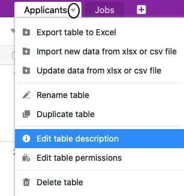

Jede Tabelle in Ihrer Base können Sie mit einer Beschreibung versehen. Mit diesem prägnanten Text können Sie beispielsweise die Tabelleninhalte erläutern.

{{< warning  type="warning" headline="Wichtiger Hinweis"  text="Sie können – unabhängig von Ihrer [Rolle und Berechtigung](\"https://seatable.io/docs/arbeiten-mit-gruppen/gruppenmitglieder-und-ihre-berechtigungen/\") – auch die Tabellenbeschreibungen in Bases bearbeiten, die zu einer **Gruppe** gehören. Die Beschreibung von Tabellen, die an Sie [freigegeben](\"https://seatable.io/docs/freigaben/einzelne-tabellenblaetter-einer-base-freigeben/\") wurden, können Sie hingegen ausschließlich mit **Schreibrechten** bearbeiten." />}}

## Wie Sie eine Beschreibung zu einer Tabelle hinzufügen

1. Klicken Sie auf das **dreieckige Drop-down-Symbol** neben dem Namen einer beliebigen Tabelle.
2. Wählen Sie die Option **Tabellenbeschreibung bearbeiten**.

 4. Fügen Sie der Tabelle eine **Beschreibung** hinzu. 5. Bestätigen Sie mit **Abschicken**.

## Wo Sie die Tabellenbeschreibung finden

Tabellen mit einer hinzugefügten **Tabellenbeschreibung** können Sie stets an einem **i-Symbol** rechts neben dem Tabellennamen erkennen.

Sie können sich Tabellenbeschreibungen stets anzeigen lassen, indem Sie mit der Maus über das **i-Symbol** fahren.

Mit einem Klick auf das **i-Symbol** können Sie die aktuelle Tabellenbeschreibung ebenfalls **bearbeiten**.

