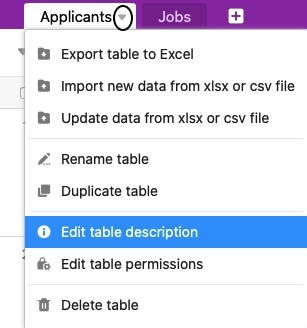

Vous pouvez ajouter une description à chaque tableau de votre base. Ce texte concis vous permet par exemple d'expliquer le contenu des tableaux.



Vous pouvez - indépendamment de votre [rôle et]() de vos [droits]() - également modifier les descriptions de tables dans les bases qui appartiennent à un **groupe**. En revanche, vous ne pouvez modifier la description des tables qui vous ont été [partagées]() qu'avec des **droits d'écriture**.



## Comment ajouter une description à un tableau

1. Cliquez sur l'**icône triangulaire déroulante** à côté du nom de n'importe quel tableau.
2. Sélectionnez l'option **Modifier la description du tableau**.

4. Ajoutez une **description** au tableau.
5. Confirmez en cliquant sur **Envoyer**.

## Où trouver la description du tableau

Vous pouvez toujours reconnaître les tableaux avec une **description de tableau** ajoutée grâce à une **icône i** à droite du nom du tableau.

Vous pouvez toujours afficher les descriptions des tableaux en passant la souris sur l'**icône i**. Vous pouvez également cliquer sur l'**icône de** votre choix.

En cliquant sur l'**icône i**, vous pouvez également **modifier** la description actuelle du tableau.

