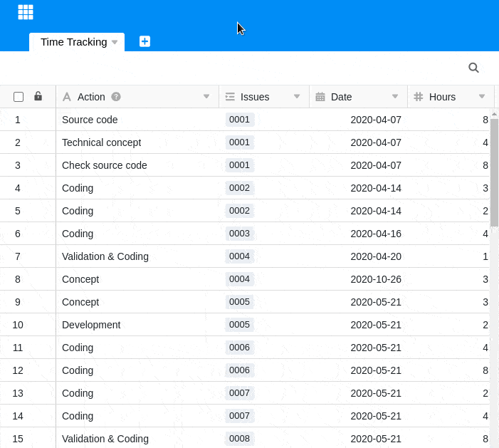

As tabelas em SeaTable podem conter milhares de registos de dados. Para lhe permitir encontrar rápida e facilmente células ou valores individuais, a SeaTable oferece a possibilidade de procurar valores e termos individuais.

## Para encontrar o que procura numa mesa

1. Abra qualquer **tabela** numa Base onde esteja à procura de um valor ou célula específica.
2. Clique na **lupa** na parte superior direita sob as opções da base.
3. Introduza um **valor** ou um **termo no** campo de pesquisa.
4. Os **resultados da pesquisa** correspondente são automaticamente apresentados e realçados a cores.
5. Pode alternar entre os resultados da pesquisa usando os **símbolos triangulares** no campo de pesquisa.

## Duas dicas profissionais

A pesquisa SeaTable oferece mais duas funções de que não queremos privá-lo:

- Se, após clicar na lupa, clicar em **Pesquisar todas as tabelas** abaixo do campo de pesquisa, abre-se uma janela na qual pode pesquisar **todas as** **tabelas** pertencentes à base para o termo ou valor que introduziu.
- É claro que o SeaTable também suporta a combinação chave  + para activar o campo de pesquisa.
