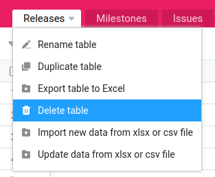

Sie benötigen einzelne Tabellen aus Ihren Bases nicht mehr? Dann können Sie diese mit wenigen Mausklicks löschen. So einfach geht es:

1. In Ihrer Base finden Sie oben links alle **Tabellen der Base** als Reiter dargestellt.
2. Klicken Sie auf das **Dreieck-Symbol** am Ende des **Namens der Tabelle**, die Sie löschen möchten.
3. Klicken Sie auf **Tabelle löschen**.
4. Bestätigen Sie die Löschung, indem Sie nochmals auf **Löschen** drücken.



## Häufige Fragen

In SeaTable brauchen Sie keine Angst vor dem Löschen zu haben. Selbst wenn Sie versehentlich mal eine Tabelle, Zeile oder Spalte löschen, können Sie diese problemlos [wiederherstellen](https://seatable.io/docs/bases-verwalten/eine-geloeschte-tabelle-wiederherstellen/). Sie finden Ihre gelöschten Daten im Papierkorb der Base.

Wenn nur noch eine Tabelle in einer Base vorhanden ist, wird die Option _Tabelle löschen_ nicht mehr angezeigt. Außerdem müssen Sie über die notwendige Berechtigung verfügen, um eine Tabelle löschen zu dürfen.


