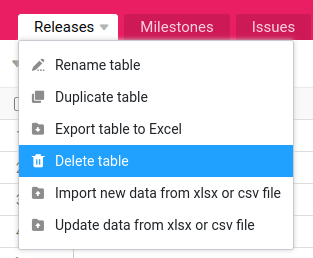

Vous n'avez plus besoin de certains tableaux de vos bases ? Vous pouvez alors les supprimer en quelques clics de souris. C'est aussi simple que cela :

1. Dans votre base, vous trouverez en haut à gauche tous les **tableaux de la base** représentés sous forme d'onglets.
2. Cliquez sur l'**icône en forme de triangle** à la fin du **nom du tableau** que vous souhaitez supprimer.
3. Cliquez sur **Supprimer le tableau**.
4. Confirmez la suppression en appuyant à nouveau sur **Supprimer**.



## Questions fréquentes


Dans SeaTable, vous ne devez pas avoir peur d'effacer. Même si vous supprimez accidentellement un tableau, une ligne ou une colonne, vous pouvez les [récupérer]() sans problème. Vous trouverez vos données supprimées dans la corbeille de la base.



S'il n'y a plus qu'un seul tableau dans une base, l'option _Supprimer le tableau_ n'est plus affichée. En outre, vous devez disposer de l'autorisation nécessaire pour pouvoir supprimer une table.

