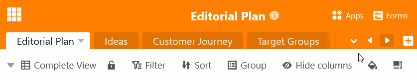

Bei Bases mit einer großen Anzahl an Tabellen können nicht mehr alle **Tabs im Base-Header** angezeigt werden. Auch [ausgeblendete Tabellen]() sind nicht mehr im Base-Header zu finden. Deshalb bietet SeaTable die Möglichkeit, nach einer **Tabelle zu suchen**.

- Klicken Sie auf den **Drop-down-Pfeil** rechts neben der letzten sichtbaren Tabelle.
- Scrollen Sie durch die **Liste der Tabellen** oder geben Sie einen Teil des Tabellennamens in das **Suchfeld** ein.
- Klicken Sie auf den **Tabellennamen**, um die gewünschte Tabelle zu öffnen.

Des Weiteren können Sie Tabellen im Base-Header mithilfe der **Pfeiltasten**  und  finden.



Sie können Tabellen auch [per Drag-and-Drop verschieben](), um Ihre meistgenutzten Tabellen immer griffbereit links im Base-Header zu sehen.


