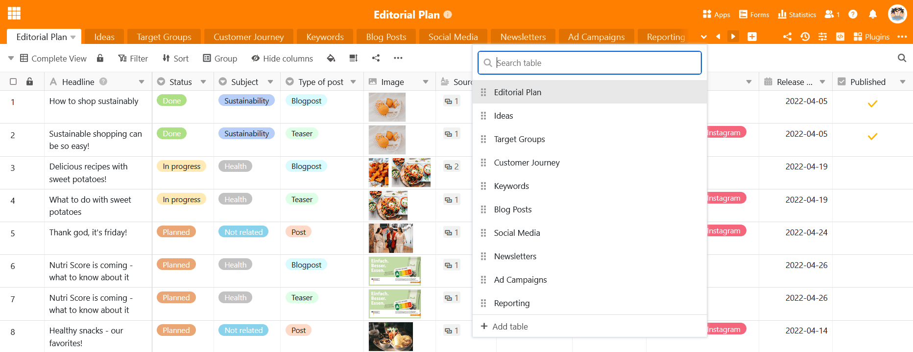

Pour les bases avec un grand nombre de tableaux, tous les **onglets** ne peuvent plus être affichés **dans l'en-tête de la base**. De même, [les tableaux masqués]() ne peuvent plus être trouvés dans l'en-tête de la base. C'est pourquoi SeaTable offre la possibilité de rechercher un **tableau**.

- Cliquez sur la **flèche déroulante** à droite du dernier tableau visible.
- Faites défiler la **liste des tableaux** ou saisissez une partie du nom du tableau dans le **champ de recherche**.
- Cliquez sur le **nom du tableau** pour ouvrir le tableau souhaitée.

Vous pouvez également trouver des tableaux dans l'en-tête de base à l'aide des **touches fléchées**  et .



Vous pouvez également [déplacer]() les tableaux [par glisser-déposer]() pour que vos tableaux les plus utilisés soient toujours à portée de main à gauche de l'en-tête de la base.


