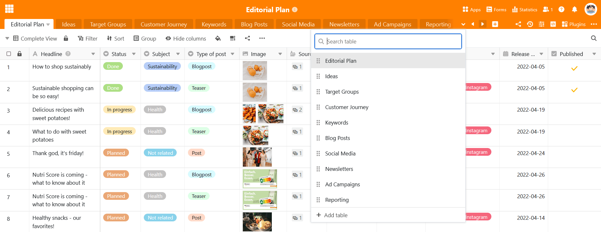
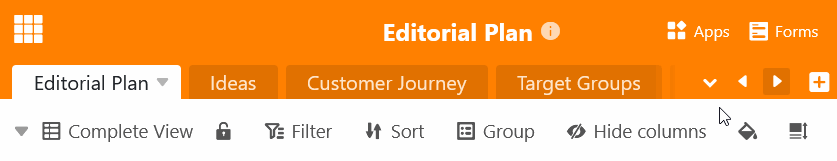

Для баз с большим количеством таблиц не все **вкладки** могут быть отображены **в заголовке базы**. Даже [скрытые таблицы]() больше не могут быть найдены в заголовке базы. Поэтому SeaTable предлагает возможность поиска **таблицы**.

- Нажмите на **стрелку раскрывающегося** списка справа от последней видимой таблицы.
- Прокрутите **список таблиц** или введите часть названия таблицы в **поле поиска**.
- Щелкните по **названию таблицы**, чтобы открыть нужную таблицу.

Вы также можете найти таблицы в заголовке базы с помощью **кнопок со стрелками**  и .



Вы также можете [перемещать]() таблицы [с помощью перетаскивания](), чтобы наиболее часто используемые таблицы всегда были под рукой слева в заголовке базы.


