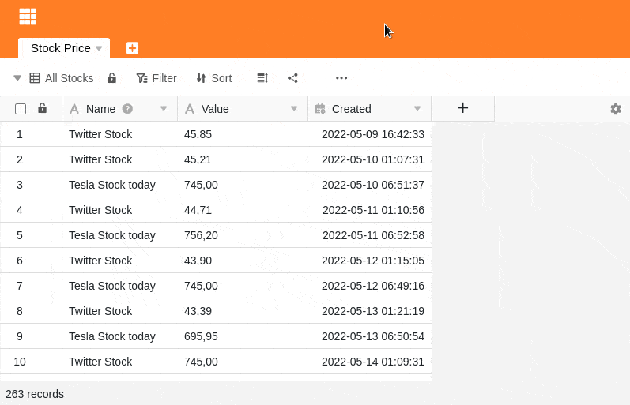

SeaTable oferece-lhe uma função confortável para procurar todas as entradas de um valor especial numa tabela e para substituir ou valores individuais específicos ou todos de uma só vez. Ficará surpreendido com a facilidade com que é fácil.

## Pesquisar e substituir valores individuais

1. Clique nos **três pontos** nas opções de visualização.
2. Seleccione **Pesquisar e Substituir**.
3. Primeiro seleccione a **coluna** em que pretende pesquisar o valor correspondente.
4. Se estiver exclusivamente à procura de **correspondências exactas**, **active** o **controlo deslizante** correspondente.
5. No campo **Search for**, introduza o **valor** que procura.
6. No campo **Substituir por por**, introduza qualquer **valor** com o qual deseja **substituir** o valor que procura.
7. Depois de preencher todos os campos, os **valores encontrados** na tabela são marcados **a cores**. Com um clique em **Substituir** pode substituir o **valor** actualmente **marcado**.

## Correspondência exacta

Uma **correspondência exacta** só é dada se introduzir o valor que procura na tabela no campo de pesquisa sem qualquer desvio. Se o deslizador correspondente **não** estiver activado, os resultados da pesquisa já serão exibidos depois de ter introduzido fracções do valor que está à procura.

## Troca entre termos de pesquisa

Pode alternar entre os resultados da pesquisa usando o **Back** and **Next**. Desta forma, pode encontrar rapidamente o valor que pretende substituir.
