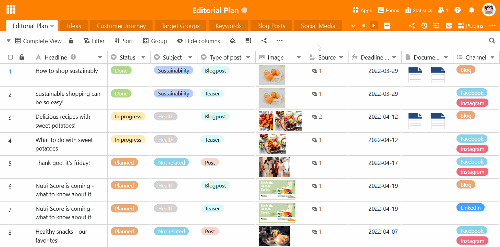

L'en-tête de la base peut devenir confus, en particulier dans le cas de bases contenant un grand nombre de tableaux. C'est pourquoi SeaTable offre la possibilité de **masquer** les **tableaux** moins souvent utilisés. Un tableau masqué n'est plus affiché comme onglet dans l'en-tête de la base et ne peut être appelé que par le **menu déroulant**.

- Cliquez sur la **flèche déroulante** à droite du dernier tableau visible.
- Passez la souris sur la **liste des tableaux** et cliquez sur l'**icône en forme d'œil** à droite de chaque tableau que vous souhaitez masquer.
- Les **onglets** des tableaux correspondants disparaissent et une **indication** du nombre de tableaux masqués apparaît en permanence dans l'en-tête de la base.

Dans un tableau masqué, vous pouvez **travailler sans restriction** comme dans un tableau visible. Si vous souhaitez **faire réapparaître** un tableau dans l'en-tête de base, procédez exactement comme décrit dans les instructions ci-dessus.



D'ailleurs, vous pouvez aussi [déplacer]() les tableaux [par glisser-déposer]() pour que vos tableaux les plus utilisés soient toujours à portée de main à gauche dans l'en-tête de la base.


