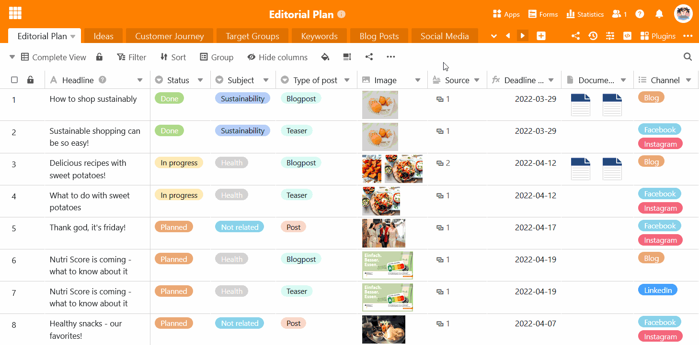

O cabeçalho da base pode tornar-se confuso, especialmente para bases com um grande número de tabelas. Por este motivo, o SeaTable oferece a opção de **ocultar as tabelas** utilizadas com menos frequência. Uma tabela oculta deixa de ser apresentada como um separador no cabeçalho da base e só pode ser acedida através do **menu pendente**.

- Clique na **seta pendente** à direita da última tabela visível.
- Mova o rato sobre a **lista de tabelas** e clique no **símbolo do olho** à direita de cada tabela que pretende ocultar.
- Os **separadores** das tabelas correspondentes desaparecem e aparece uma **nota** permanente no cabeçalho da base indicando quantas tabelas estão ocultas.

Pode **trabalhar** numa tabela oculta da mesma forma que numa tabela visível **, sem quaisquer restrições**. Se pretender voltar a **mostrar** uma tabela no cabeçalho de base, proceda exatamente da mesma forma como descrito nas instruções acima.



A propósito, também pode [mover]() as tabelas [utilizando a função arrastar e largar](), para que as tabelas utilizadas com mais frequência estejam sempre à mão, à esquerda, no cabeçalho da base.


