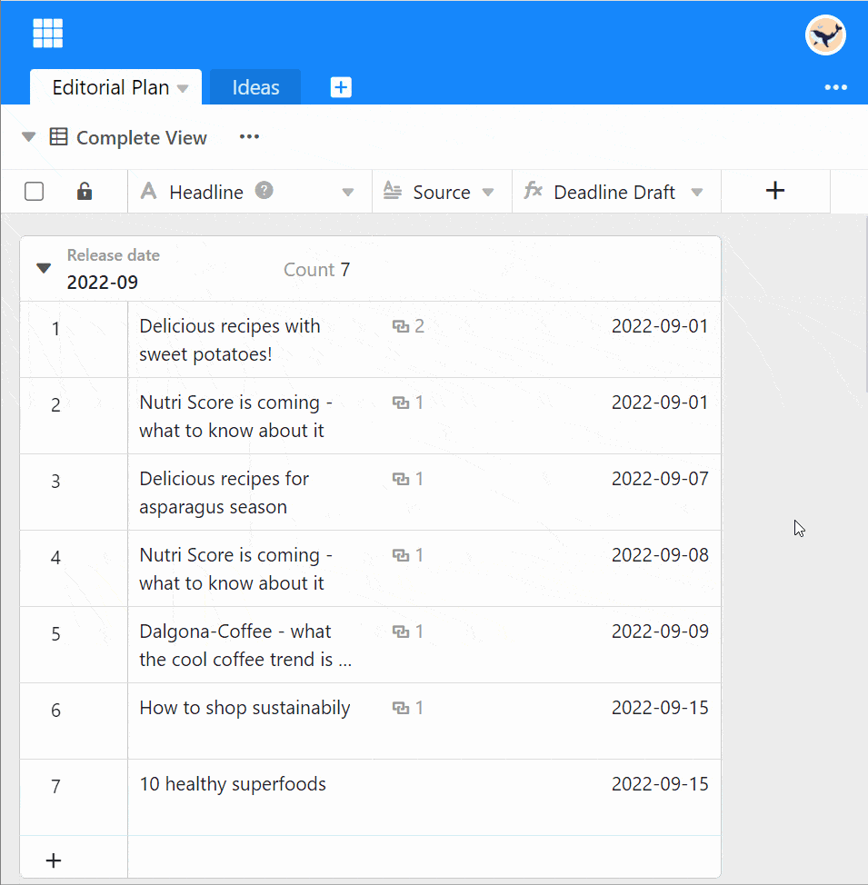



Con la suscripción correspondiente, en SeaTable tiene la opción de restringir el uso y la edición de sus tablas o bloquearlas para determinados usuarios.

## Establecer permisos dentro de las tablas

1. Haga clic en el **icono triangular desplegable** situado junto al nombre de la tabla.
2. Seleccione la opción **Editar autorización de la tabla**.
3. Ahora puede seleccionar en las siguientes líneas si desea utilizar la autorización para **Administradores**, **Nadie**, **Usuario designado** o **Cada** quisiera emitir.
    - ¿Quién puede añadir líneas?
    - ¿Quién puede suprimir líneas?
    - ¿Quién puede editar las líneas?
    - ¿Quién puede ver las líneas?

## Preguntas frecuentes


Por **administradores** no se entiende los administradores generales del equipo, sino los administradores y propietarios de un grupo.



Esta combinación no funciona. Sólo los que pueden ver filas pueden también editarlas o añadir nuevas filas.

