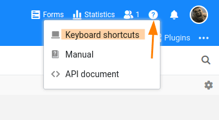

En SeaTable, las acciones y operaciones recurrentes pueden realizarse cómodamente mediante combinaciones de teclas. Insertar una nueva fila, mostrar los detalles de la fila o deshacer una acción: en SeaTable todo esto puede hacerse en una fracción de segundo con la combinación de teclas adecuada.



Por cierto, para tener una visión rápida de todas las combinaciones de teclas, no hace falta que vuelvas una y otra vez a este sitio web. También puede encontrar el resumen de todas las combinaciones de teclas directamente en SeaTable. Ábrelo con   o haciendo clic en el icono del signo de interrogación de la esquina superior derecha.

## Atajos en SeaTable

| General                                                                                                                                     |                                                                                                              |
| ------------------------------------------------------------------------------------------------------------------------------------------- | ------------------------------------------------------------------------------------------------------------ |
|                                                                                                            | Abre la función de búsqueda. Con  vuelva a cerrar el cuadro de búsqueda.                    |
|                                                                                                            | Mostrar el siguiente resultado de búsqueda.                                                                  |
|                                                                                         | Mostrar resultado de búsqueda anterior.                                                                      |
| Vista de la tabla                                                                                                                           |                                                                                                              |
|                                                                                                            | Abrir la vista general de los accesos directos disponibles.                                                  |
|                                                                                                            | Deshacer la última acción.                                                                                   |
|                                                                                         | Vuelva a realizar la última acción.                                                                          |
|                                                                                                            | Establecer la fecha seleccionada o el campo de hora/fecha en el día de hoy.                                  |
|                                                                                                            | Imprime la vista actual o los detalles de la fila.                                                           |
|                                                                                                            | Copiar una celda o selección de celdas.                                                                      |
|                                                                                                            | Cortar una celda o selección de celdas.                                                                      |
|                                                                                                            | Bloquear/desbloquear línea (requiere una suscripción Enterprise).                                            |
|                                                                                                            | Insertar una celda (si se seleccionan varias celdas, el valor se inserta en todas las celdas seleccionadas). |
|                                                                                                                        | Desplegar la línea seleccionada.                                                                             |
|                           | Pantalla de desplazamiento (arriba / abajo / izquierda / derecha)                                            |
|         | Desplácese hasta el borde de la tabla correspondiente (arriba / abajo / izquierda / derecha).                |
|                                                                                                    | Inserta una nueva fila debajo de la celda seleccionada actualmente.                                          |
|                                                                                  | Añada una nueva fila y abra los detalles de la fila.                                                         |
|                                                                                                            | Mostrar columna de comentarios.                                                                              |
| Detalles de la línea                                                                                                                        |                                                                                                              |
|                                     | Ir a los detalles de la fila siguiente / anterior.                                                           |
|                                                                                                                            | Cerrar los detalles de la fila.                                                                              |

## Notas

- Con las combinaciones de teclas, no importa si una letra como  es mayúscula o minúscula. Para pulsar una combinación de teclas, no es necesario cambiar a la introducción de mayúsculas.
- Mantenga siempre pulsada primero la tecla de función y después la tecla de letra. Por ejemplo  mantenga pulsada la tecla  y pulse una vez .

## Tabla comparativa distribución del teclado alemán/inglés

El etiquetado de las teclas de función y la disposición de algunas de las teclas afectadas en este artículo son diferentes en un teclado alemán y en uno inglés. Como la tabla anterior es adecuada para teclados ingleses, a continuación se muestra una tabla comparativa de las teclas afectadas.

Por ejemplo: Si en un teclado inglés la combinación de teclas   debe ser presionado, puede utilizar un teclado alemán para   de la prensa.

| Tecla de un teclado inglés | Tecla de un teclado alemán |
| -------------------------- | -------------------------- |
|             |             |
|          |          |
|         |             |
|             |             |
|             |             |
|       |       |
|          |       |
|          |       |
