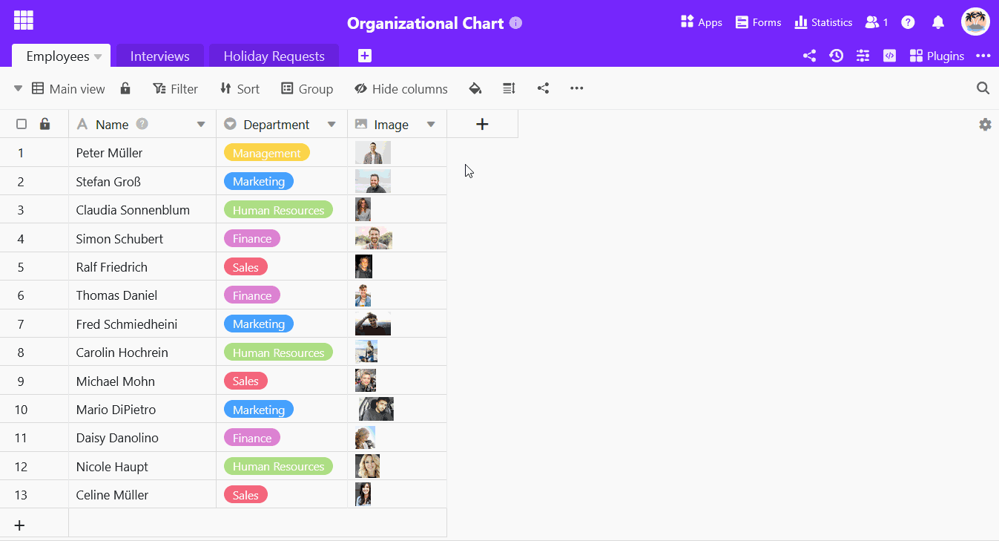
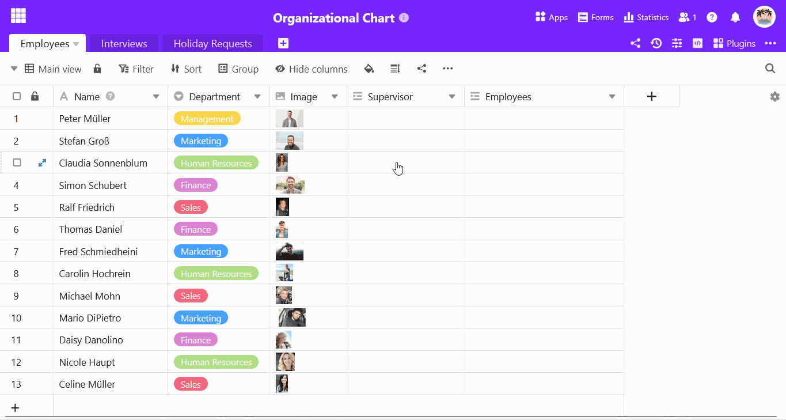

É possível utilizar uma **coluna de ligação** no SeaTable não só para [ligar várias tabelas](), mas também para **relacionar registos de dados numa única tabela**.

Isto é particularmente útil se os dados na sua tabela tiverem uma **hierarquia**.

## Adicionar uma ligação numa tabela

1. Clique no **símbolo de mais** à direita do cabeçalho da última coluna.
2. Introduza o **nome da coluna superior** no campo de entrada.
3. Selecione **Ligação a outras entradas** como o tipo de coluna.
4. Selecionar **a tabela atual** como a tabela a ser ligada.
5. Confirmar com **Submeter**.
6. O SeaTable adiciona automaticamente uma **segunda coluna para as entradas subordinadas**.



As duas colunas de ligação estão **indissociavelmente** ligadas. Se **eliminar** uma das duas colunas, a outra também desaparece imediatamente. No entanto, se apenas pretender ver uma das duas colunas na sua tabela, pode [ocultar]() a outra.



## Ligação de registos de dados numa tabela

1. Clique numa **célula da coluna de ligação** e, em seguida, no **símbolo de mais** que aparece.
2. As **linhas** disponíveis **na tabela** são agora listadas. Clique na(s) linha(s) que gostaria de ligar à linha selecionada.
3. **A entrada ligada** é imediatamente apresentada em ambas as colunas de ligação.



## Porque é que existem duas colunas para a mesma ligação?

Se criar uma coluna de ligação que ligue entradas numa e na mesma tabela, o SeaTable cria automaticamente uma segunda coluna de ligação.

- Na **primeira** coluna de ligação, é possível ver os registos de dados que são **superordenados a** uma linha.
- Na **segunda** coluna de ligação, é possível ver os registos de dados que estão **subordinados a** uma linha.

Os **pais e os filhos** de uma relação pai-filho são, portanto, registados e apresentados em colunas separadas. Desta forma, o SeaTable assegura que existe um registo de dados pai e um registo de dados filho para cada relação.



## Artigos relacionados

- Se pretender **visualizar** claramente as ligações hierárquicas, recomendamos vivamente o [plugin do organigrama]().
- Para todas as outras questões sobre o tratamento de colunas de ligação, consulte o artigo [Como ligar tabelas no SeaTable]().
