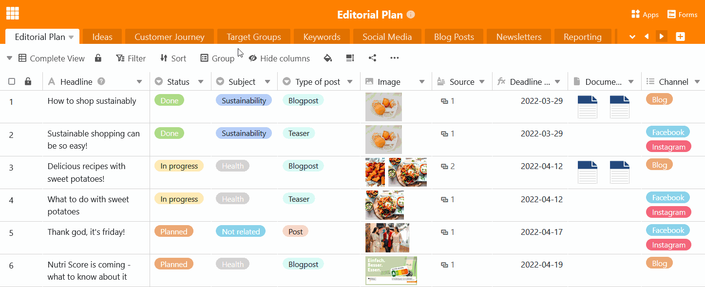

A más tardar cuando tu base se haya llenado gradualmente con varias mesas, es hora de pensar en un **orden sensato de las mesas** de tu base. **Coloca** las mesas relacionadas temáticamente unas junto a otras y coloca las más importantes en la parte superior. Ya lo verás: Gracias a **la función de arrastrar y soltar**, mover mesas es un juego de niños.

## Para desplazar una tabla en la cabecera base

Puede organizar sus tablas horizontalmente en la cabecera base como desee.

1. Mueve el ratón a la pestaña **de** la tabla que quieras mover.
2. Mantenga pulsado el botón izquierdo del ratón y **arrastre y suelte** la tabla deseada en cualquier posición de la cabecera base.

## Para desplazar una tabla mediante el menú desplegable

En bases con un gran número de tablas, es más cómodo mover las tablas verticalmente utilizando la lista desplegable.

1. Haga clic en la **flecha desplegable** situada a la derecha de la última tabla visible.
2. Mueva el ratón a la **posición de la lista de la tabla** que desea mover.
3. Mantenga pulsado el botón izquierdo del ratón y **arrastre y suelte** la tabla en la posición deseada.
