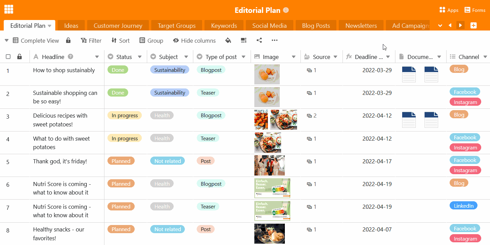

Au plus tard lorsque votre base s'est peu à peu remplie de divers tableaux, il est temps de réfléchir à un **ordre judicieux des tableaux** dans votre base. **Déplacez** les tableaux thématiques les uns à côté des autres et placez les tableaux les plus importants au début. Vous verrez que cela fonctionne : Grâce au **glisser-déposer**, le déplacement est un jeu d'enfant.

## Pour déplacer un tableau dans l'en-tête de base, procédez comme suit

Vous pouvez organiser vos tableaux horizontalement dans l'en-tête de base comme vous le souhaitez.

1. Déplacez votre souris sur l'**onglet** du tableau que vous souhaitez déplacer.
2. Maintenez le bouton gauche de la souris enfoncé et **glissez et déposez** le tableau souhaité à l'endroit de votre choix dans l'en-tête de la base.

## Pour déplacer un tableau à l'aide du menu déroulant, procédez comme suit

Dans les bases avec de très nombreux tableaux, il est plus confortable de déplacer les tableaux verticalement à l'aide de la liste déroulante.

1. Cliquez sur la **flèche déroulante** à droite du dernier tableau visible.
2. Déplacez votre souris sur l'**emplacement de la liste du tableau** que vous souhaitez déplacer.
3. Maintenir le bouton gauche de la souris enfoncé et **glisser-déposer** le tableau à l'endroit souhaité.
