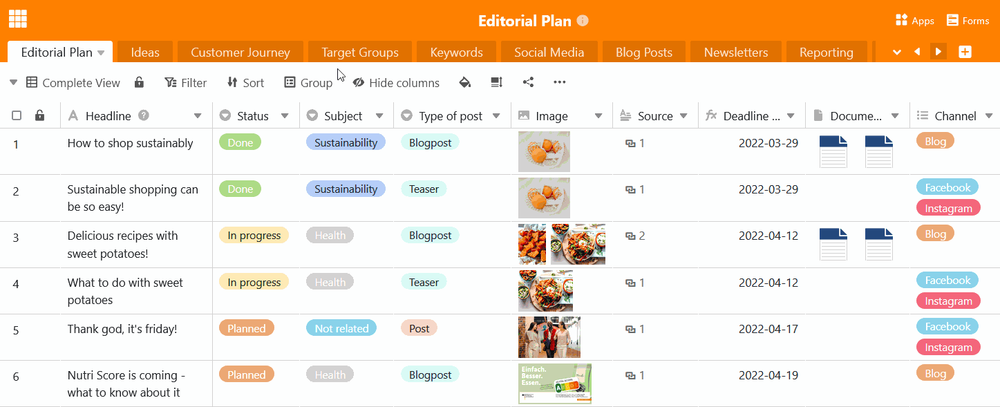
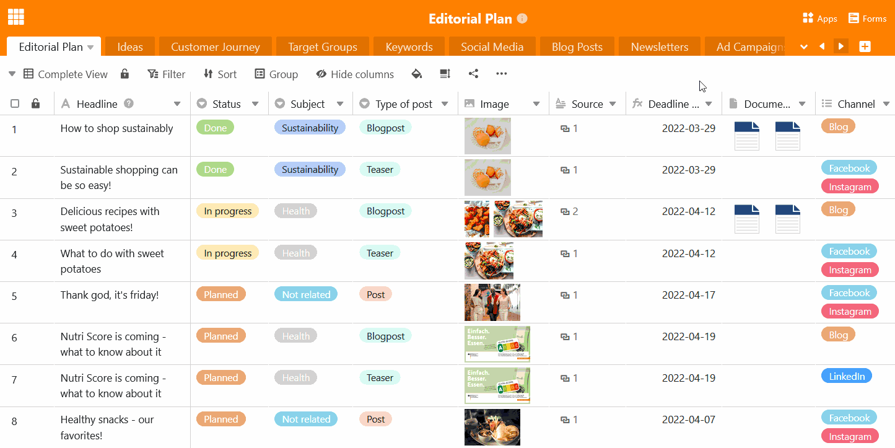

O mais tardar quando a sua base estiver gradualmente preenchida com várias mesas, é altura de pensar numa **ordem sensata das mesas** na sua base. **Coloque** as tabelas relacionadas com a temática umas ao lado das outras e as mais importantes no topo. Vai ver: Graças à função **arrastar e largar**, mover as tabelas é uma brincadeira de crianças.

## Para deslocar uma tabela no cabeçalho de base

Pode dispor as suas tabelas horizontalmente no cabeçalho de base como desejar.

1. Mova o seu rato para a aba **da** mesa que pretende mover.
2. Mantenha premido o botão esquerdo do rato e arraste **e largue** a tabela pretendida para qualquer posição no cabeçalho da base.

## Para deslocar uma tabela utilizando o menu pendente

Em bases com um grande número de tabelas, é mais conveniente deslocar as tabelas verticalmente utilizando a lista pendente.

1. Clique na **seta pendente** à direita da última tabela visível.
2. Mova o rato para a **posição da lista da tabela** que pretende deslocar.
3. Mantenha premido o botão esquerdo do rato e arraste **e largue** a tabela para a posição pretendida.
