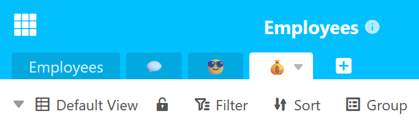

Mit jeder weiteren Tabelle, die Sie zu Ihrer Base hinzufügen, wird die [Tabellen-Navigation](https://seatable.io/docs/arbeiten-in-tabellen/nach-einer-tabelle-suchen/) im Base-Header unübersichtlicher. Um dieses Problem zu lösen, unterstützt SeaTable das [Ausblenden von Tabellen](https://seatable.io/docs/arbeiten-in-tabellen/tabellen-ausblenden/) und die **Verwendung von Emojis im Tabellennamen**.

## Emojis in den Tabellennamen einfügen

Wenn Sie Tabellen nicht mehr mit Begriffen, sondern mit passenden **Emojis** benennen, reduziert sich die **Breite der Tabellenreiter** und Sie können mehr Tabellen im Blick behalten.

Wie wäre es beispielsweise mit Symbolen für Vorstellungsgespräche (z. B. Sprechblase), Urlaubsanträge (z. B. Smiley mit Sonnenbrille) und Gehaltsabrechnungen (z. B. Geldsack) für die Base einer Personalabteilung?

Probieren Sie es einfach aus! Kopieren Sie ein zu Ihrer Tabelle passendes **Emoji** und fügen Sie es in den **Tabellennamen** ein.



## Tabelle umbenennen und Emoji einfügen

- Klicken Sie auf den **Drop-down-Pfeil** rechts neben dem Tabellennamen, den Sie ändern möchten.
- Gehen Sie im geöffneten Drop-down-Menü auf **Tabelle umbenennen**.
- Löschen Sie den bisherigen **Tabellennamen** aus dem Eingabefeld.
- Kopieren Sie ein **Emoji** und fügen Sie es in das **Eingabefeld** ein.
- Bestätigen Sie mit **Abschicken**.



## Neue Tabelle mit Emoji hinzufügen

- Klicken Sie auf das **Plus-Symbol** rechts neben dem letzten Tabellenreiter.
- Gehen Sie im geöffneten Drop-down-Menü auf **Tabelle hinzufügen**.
- Löschen Sie den bisherigen **Tabellennamen** aus dem Eingabefeld.
- Kopieren Sie ein **Emoji** und fügen Sie es in das **Eingabefeld** ein.
- Bestätigen Sie mit **Abschicken**.


