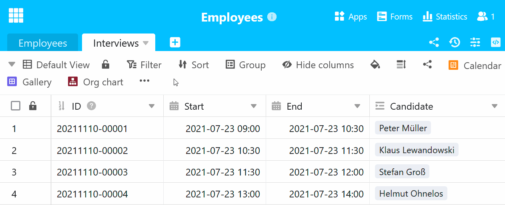

With each additional table you add to your base, the [table navigation](https://seatable.io/en/docs/arbeiten-in-tabellen/nach-einer-tabelle-suchen/) in the base header becomes more confusing. To solve this problem, SeaTable supports the [hiding of tables](https://seatable.io/en/docs/arbeiten-in-tabellen/tabellen-ausblenden/) and the **use of emojis in the table name**.

## Insert emojis in the table name

If you name tables with matching **emojis** instead of terms, the **width of the table tabs** is reduced and you can keep more tables in view.

How about, for example, symbols for job interviews (e.g. speech bubble), vacation requests (e.g. smiley face with sunglasses) and payslips (e.g. money bag) for the base of an HR department?

Just try it out! Copy an **emoji** that matches your table and insert it into the **table name**.



## Rename table and insert emoji

- Click on the **drop-down arrow** to the right of the table name you want to change.
- In the drop-down menu that opens, click on **Rename table**.
- Delete the previous **table name** from the input field.
- Copy an **emoji** and paste it into the **input field**.
- Confirm with **Submit**.



## Add new table with emoji

- Click on the **plus symbol** to the right of the last table tab.
- In the drop-down menu that opens, click **Add table**.
- Delete the previous **table name** from the input field.
- Copy an **emoji** and paste it into the **input field**.
- Confirm with **Submit**.


