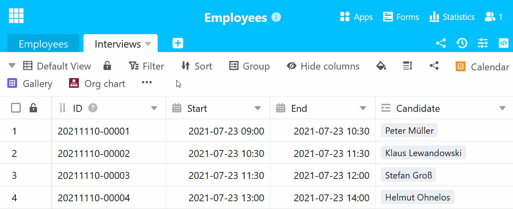
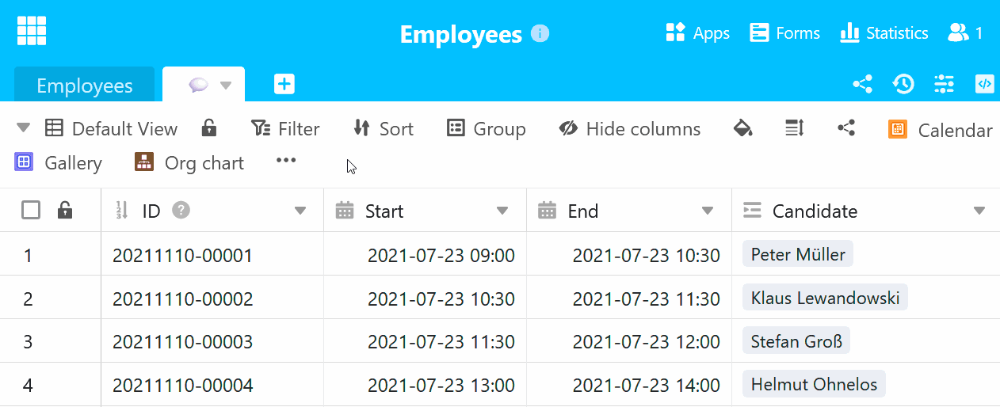

Chaque fois que vous ajoutez un tableau à votre base, la [navigation]() dans [les tableaux]() de l'en-tête de la base devient plus confuse. Pour résoudre ce problème, SeaTable prend en charge le [masquage des tableaux]() et l'**utilisation d'emojis dans le nom des tableaux**.

## Insérer des emojis dans le nom du tableau

Si vous ne nommez plus les tableaux avec des termes, mais avec **des emojis** appropriés, la **largeur des onglets des tableaux** se réduit et vous pouvez garder un œil sur davantage de tableaux.

Que diriez-vous, par exemple, de symboles pour les entretiens d'embauche (par exemple, une bulle), les demandes de congé (par exemple, un smiley avec des lunettes de soleil) et les fiches de paie (par exemple, un sac d'argent) pour la base d'un service du personnel ?

Essayez-le tout simplement ! Copiez un **emoji** correspondant à votre tableau et collez-le dans le **nom du tableau**.



## Renommer le tableau et insérer un emoji

- Cliquez sur la **flèche déroulante** à droite du nom du tableau que vous souhaitez modifier.
- Allez sur **Renommer le tableau** dans le menu déroulant ouvert.
- Effacez l'ancien **nom de tableau** du champ de saisie.
- Copiez un **emoji** et collez-le dans le **champ de saisie**.
- Confirmez en cliquant sur **Envoyer**.



## Ajouter un nouveau tableau avec un emoji

- Cliquez sur le **symbole plus** à droite du dernier onglet du tableau.
- Allez sur **Ajouter un tableau** dans le menu déroulant qui s'est ouvert.
- Effacez l'ancien **nom de tableau** du champ de saisie.
- Copiez un **emoji** et collez-le dans le **champ de saisie**.
- Confirmez en cliquant sur **Envoyer**.


