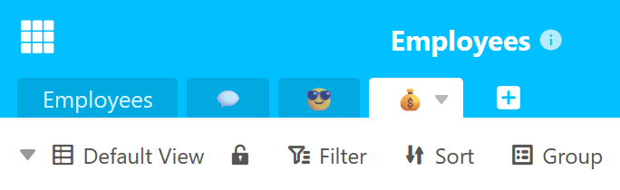
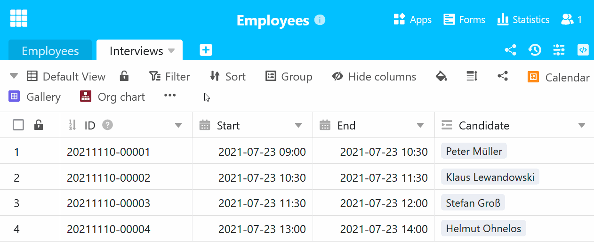
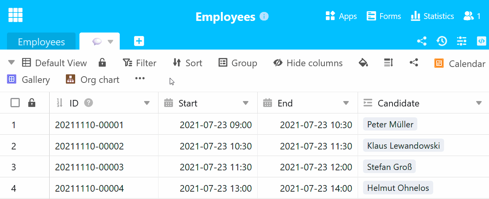

Com cada tabela adicional que adiciona à sua base, a [navegação da tabela]() no cabeçalho da base torna-se mais confusa. Para resolver este problema, o SeaTable suporta a [ocultação de tabelas]() e a **utilização de emojis no nome da tabela**.

## Inserir emojis no nome da mesa

Se nomear tabelas com **emojis** correspondentes em vez de termos, a **largura dos separadores da tabela** é reduzida e pode manter mais tabelas à vista.

Que tal, por exemplo, símbolos para entrevistas de emprego (por exemplo, balão de diálogo), pedidos de férias (por exemplo, cara sorridente com óculos de sol) e folhas de vencimento (por exemplo, saco de dinheiro) para a base de um departamento de RH?

Experimente! Copie um **emoji** que corresponda à sua mesa e insira-o no **nome da mesa**.



## Mudar o nome da tabela e inserir emoji

- Clique na **seta pendente** à direita do nome da tabela que pretende alterar.
- No menu pendente que se abre, clique em **Mudar o nome da tabela**.
- Eliminar o **nome da tabela** anterior do campo de entrada.
- Copie um **emoji** e cole-o no **campo de introdução**.
- Confirmar com **Submeter**.



## Adicionar nova tabela com emoji

- Clique no **símbolo de mais** à direita do último separador da tabela.
- No menu pendente que se abre, clique em **Adicionar tabela**.
- Eliminar o **nome da tabela** anterior do campo de entrada.
- Copie um **emoji** e cole-o no **campo de introdução**.
- Confirmar com **Submeter**.


