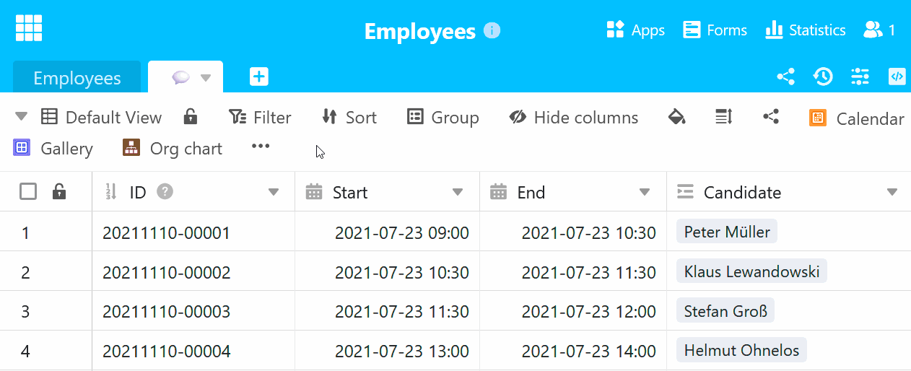

С каждой дополнительной таблицей, которую вы добавляете в базу, [навигация по таблицам]() в заголовке базы становится все более запутанной. Чтобы решить эту проблему, SeaTable поддерживает [скрытие таблиц]() и **использование эмодзи в названии таблицы**.

## Вставка эмодзи в название таблицы

Если вместо терминов назвать таблицы соответствующими **эмодзи**, **ширина вкладок таблиц** уменьшится, и вы сможете держать в поле зрения больше таблиц.

Как насчет, например, символов для собеседований (например, речевой пузырь), заявлений на отпуск (например, смайлик в солнечных очках) и платежных ведомостей (например, денежный мешок) для базы отдела кадров?

Просто попробуйте! Скопируйте **эмодзи**, соответствующий вашей таблице, и вставьте его в **название таблицы**.



## Переименовать таблицу и вставить эмодзи

- Щелкните по **раскрывающейся стрелке** справа от названия таблицы, которое нужно изменить.
- В открывшемся выпадающем меню выберите пункт **Переименовать таблицу**.
- Удалите предыдущее **имя таблицы** из поля ввода.
- Скопируйте **эмодзи** и вставьте его в **поле ввода**.
- Подтвердите с помощью кнопки **Отправить**.



## Добавьте новую таблицу с эмодзи

- Нажмите на **символ плюса** справа от последней вкладки таблицы.
- В открывшемся выпадающем меню выберите **Добавить таблицу**.
- Удалите предыдущее **имя таблицы** из поля ввода.
- Скопируйте **эмодзи** и вставьте его в **поле ввода**.
- Подтвердите с помощью кнопки **Отправить**.


