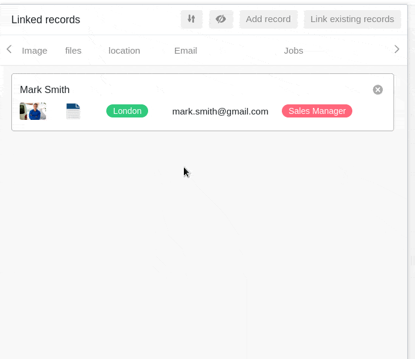

SeaTable allows you to link information from different tables. To do this, use the **Link to other entries** column type.

## To link two tables together

1. Create a new column and select the column type **Link to other entries**.
2. Give the column a **name**.
3. Under **Select table for linking**, select the table whose entries you want to link to the current table.
4. Click **Submit**.
5. The content of the new column is still empty. To fill it, you can **link existing entries** or **add new ones rows** .

As soon as tables are linked, you can call up the information of the linked entries via the **link dialog**. To do this, click on the **double arrow symbol** in a **cell of** the link column or **double-click**. The **linked entries** are listed in the link dialog that opens. Click on an entry to view the **row details** in an additional window.

## Link existing entries

1. Click in a **cell of** the **shortcut column** and then on the **plus icon** that appeared.
2. Now the available **rows of the linked table** are listed. Select the row(n) you want to link to the row of your current table.
3. In the link column, each row is immediately displayed **as a linked entry**.



Using the **integrated search function** in the link dialog, you can search the entries of the linked table to quickly find the desired row .



## Add new row

You can even add a **new row** to a **linked table** via the link dialog without having to switch to this table. Subsequently, the row is added to the linked table among the existing records and displayed as a linked entry in the link column of the opened table.

1. **Double-click** on the **cell of** a **link column** or click on the blue **double arrow icon** to open the link dialog.

2. Click **row to add**.

3. In the window that opens, fill in the various **table columns**.

4. Click **Submit** to create the new row .

5. The **new row** is automatically added to the **linked table** and displayed in the currently opened table as a **linked entry** in the link column.

## Edit existing entries of a linked table

1. Click in a **cell of** the link column.
2. Click on the **linked entry** you want to edit.
3. The **row details** open. Make the desired **changes** there.
4. **Close** the window to **save** the changes.

## Remove links

You can remove entries linked in a link column with just a few clicks. To do this, simply open the link **dialog of** the corresponding link column and click on the **X symbol to** the right of the desired entry.



## Link column settings

A link column allows you to make and change various settings very easily. To do this, click the triangular **drop-down icon of** the link column in the table header and then click **Settings**.

### Selection of the linked column from the linked table

In the drop-down menu you can first select the **column of the linked table** whose **entries** are to be displayed in the link column.

### Restrict links to one row

By activating the corresponding slider you can limit the linking to a **maximum of one row**. If this setting is active, only **one linked entry** can be added in each cell of the link column.

If you have already added a linked entry to a cell, the options to add more entries are **no** longer displayed.

This setting can be useful, for example, if an invoice is to be linked to the corresponding purchase order from another table - i.e. if the linked records form logical **pairs**. In this case, adding more links could lead to confusion and negatively affect work processes.

### Restrict links to one view

By activating this setting you can restrict links to **one view of** the linked table. To do this, you specify a previously defined **view of** the linked table. In the link column, you can then link **only** the entries of this view. Linking entries from other views is then **no** longer possible.

This setting is especially useful for [filtered views](#7-toc-title) this setting can be helpful if you want to specifically link **individual entries** in your tables.

### Prevent linking of existing entries

In the settings of a link column you can also prevent the linking of existing entries by activating a corresponding slider. If the slider is **activated**, the corresponding link column supports **only** the addition of **new rows** or entries.

Existing entries in the linked table can then **no** longer be linked in the column. Entries that have already been linked in the column, however, remain **unaffected** by the setting.

## View options of the link dialog

The link dialog of a link column also provides you with various view options.

### Adjust the size of the window

To have all linked entries at a glance, you can adjust the **size of** the link dialog window. To do this, simply move the mouse over one of the outer borders until the cursor turns into a **double arrow**, and drag the border in the desired direction while holding down the mouse button.

### Adjust column width

To fit more column entries of the linked rows into the window, you can also adjust the **width of** the displayed **columns** in the link dialog. To do this, move the mouse over the **area between two column names** until the cursor turns into a **double arrow**, and drag the invisible boundary line to the left or right while holding down the mouse button until you reach the desired **column width**.

### Hide columns

To make the link dialog even clearer, you can hide any number of columns of the linked entries by clicking on the **eye symbol**. A window opens in which you can **(de)activate** the individual columns with sliders. Accordingly, the columns are hidden or displayed in the overview of the linked entries.

### Sort entries

You can **sort** the linked entries in the link dialog by clicking on the **arrow icons**. Use this function, for example, to display linked entries in alphabetical order based on a text column or to sort them by another column.



## Frequently asked questions

The Link column is available in every SeaTable subscription. However, you are probably trying to change the column type of an existing column. When [changing the]() column type, the **Link to other entries** column type is actually _not_ available to you. Instead, create a **new column** and you will be offered the column type you want.


